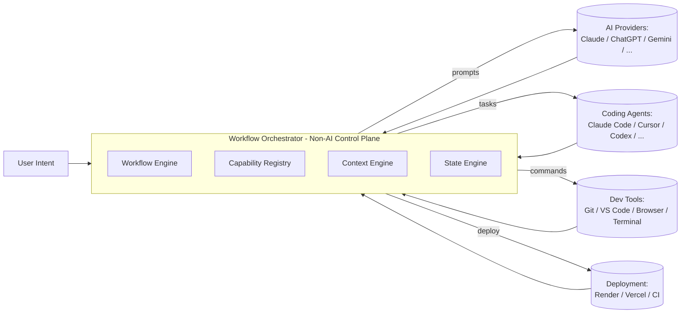
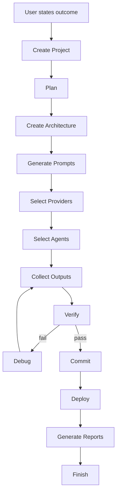

# 00 — Vision

## Purpose
Workflow Orchestrator ("the Orchestrator") is a deterministic, provider-agnostic **workflow operating system** for software engineering. It coordinates AI providers (Claude, ChatGPT, Gemini, future models), coding agents (Claude Code, Cursor, Codex, GitHub Copilot, OpenCode, FreeBuff, future agents), developer tools (Git, VS Code, terminals, browsers, clipboards), and deployment/testing infrastructure (Render, Vercel, CI runners) to turn a single stated outcome into a shipped, verified software artifact.

This document defines the north star that every other document must remain consistent with. Any design decision in `02_ARCHITECTURE.md` through `30_GLOSSARY.md` that contradicts this vision should be treated as a defect in that document, not in this one.

## Responsibilities
- Define what the Orchestrator *is* and, more importantly, what it is *not*.
- Establish the philosophical contract between user, orchestrator, and provider.
- Anchor all downstream architecture decisions to a single stated purpose.

## Goals
- **Outcome-driven UX**: the user states a desired result ("Build a premium SaaS landing page"); the Orchestrator derives the plan, prompts, provider selection, verification, and deployment.
- **Determinism**: given the same project contract, workflow definition, and provider responses, the Orchestrator's control-flow decisions are reproducible. Non-determinism is pushed to the edges (the AI providers), never into orchestration logic.
- **Provider independence**: no part of the core system may hard-code assumptions about a specific AI vendor's API shape, pricing, or capabilities beyond what is declared through the Provider interface (`05_PROVIDER_SYSTEM.md`).
- **Long-term evolution**: the system must be able to add a new provider, agent, workflow step type, or deployment target without modifying the core engine.

## Non-Goals
- The Orchestrator is **not** an LLM, not a coding model, not a chatbot, not an IDE, not "another Cursor/Claude/ChatGPT." It has zero reasoning capability of its own.
- The Orchestrator does not generate code, write prose, or make judgment calls about *what* to build. It only decides *how the work gets routed, sequenced, verified, and shipped*.
- The Orchestrator is not a hosting platform, model provider, or agent runtime — it integrates with those, it does not replace them.

## Architecture (Positioning)

## Interfaces
This document defines no code interfaces itself; it constrains all interfaces defined elsewhere. Every interface (Provider, Agent, Plugin, Workflow Step) must be expressible without the Orchestrator understanding *why* a provider produced a given output — only *what* it produced and *whether it satisfies the contract*.

## Data Models
N/A at this layer. See `10_PROJECT_CONTRACT.md` and `25_DATA_MODELS.md`.

## Workflow (Canonical Lifecycle)

## Examples
- "Build a premium SaaS landing page" → Orchestrator creates a project, produces an architecture and page-by-page prompt plan, routes design/copy prompts to one provider, routes implementation to a coding agent, verifies build/lint/visual diff, commits, deploys to Vercel, and emits a report.
- "Add OAuth login to this existing repo" → Orchestrator scans the existing project (`18_PROJECT_SCANNER.md`), derives a scoped plan constrained by the existing Project Contract, and executes a narrower version of the same lifecycle.

## Failure Scenarios
- **Vision drift**: a future contributor adds reasoning logic (e.g., "if the AI output looks wrong, have the orchestrator silently rewrite it") directly into the core engine. This violates the non-goal above and must be rejected at design review.
- **Vendor lock creep**: convenience shortcuts that assume "Claude will always be available" leak into scheduling logic, silently breaking provider independence.

## Future Expansion
- Multi-user / team orchestration (shared projects, shared capability registries).
- Marketplace of community workflows and provider/agent adapters (`11_PLUGIN_SYSTEM.md`, supporting systems in `32_SUPPORTING_SYSTEMS.md`).
- Autonomous long-running "operator mode" where the Orchestrator manages a backlog of outcomes rather than one at a time.

## Trade-offs
- Prioritizing determinism over flexibility means some genuinely useful ad-hoc behaviors (e.g., "just wing it if the plan doesn't fit") are deliberately disallowed unless expressed as a first-class workflow construct.
- Provider independence adds abstraction overhead versus deeply integrating with a single best-in-class provider.

## Open Questions
- Should the Orchestrator ever be permitted to *choose* an outcome (e.g., propose scope) or must scope always originate from the user/Project Contract?
- How much autonomy should "Finish" have to trigger a new cycle (continuous outcome pursuit) versus strictly terminating?

## References
`01_PRODUCT.md`, `02_ARCHITECTURE.md`, `10_PROJECT_CONTRACT.md`, `29_ROADMAP.md`
`docs/ARCHITECTURE_FREEZE.md` — Frozen architecture v3.0.0 (`docs/ARCHITECTURE_AUDIT.md` — Architecture audit)
`docs/IMPLEMENTATION_ROADMAP.md` — Implementation phases
