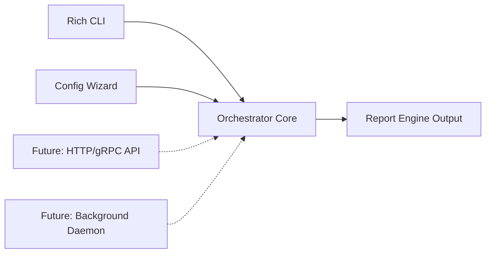

# 01 — Product

## Purpose
Defines Workflow Orchestrator as a product: who uses it, what jobs it does for them, how it is packaged, and what "done" looks like for a release.

## Responsibilities
- Describe target users and their jobs-to-be-done.
- Define product surfaces (CLI first; future daemon/API/UI).
- Define success metrics for the product, separate from engineering metrics.

## Goals
- Give solo developers and small teams a single command that takes an outcome and produces a verified, deployed result.
- Make the system self-hosted and local-first: no mandatory SaaS backend, no forced telemetry.
- Make onboarding (`24_CONFIGURATION_WIZARD.md`) fast enough that a new user reaches a working workflow in under 5 minutes.

## Non-Goals
- Not a hosted SaaS product (though nothing prevents a future hosted offering built *on* the open-source core — see `29_ROADMAP.md`).
- Not an IDE replacement; it complements VS Code, terminals, and browsers rather than reimplementing them.
- Not a project management tool for humans (no Kanban board for people) — it manages AI/agent task execution only.

## Users
| Persona | Job To Be Done |
|---|---|
| Solo indie developer | "Turn my idea into a shipped MVP without manually babysitting five AI tools." |
| Platform/DevOps engineer | "Standardize how AI-assisted changes get verified and deployed across many repos." |
| OSS maintainer | "Let contributors propose changes via outcome statements, verified deterministically before merge." |
| Plugin/provider author | "Add support for a new agent or provider without touching core code." |

## Architecture (Product Surfaces)

## Interfaces
- **CLI** (`23_CLI_DESIGN.md`) is the only supported interface at v1.
- **Project Contract** (`10_PROJECT_CONTRACT.md`) is the only supported input format for defining an outcome beyond a one-line prompt.
- **Report Engine** (`15_REPORT_ENGINE.md`) is the only supported output format for humans.

## Data Models
See `25_DATA_MODELS.md` for `Project`, `WorkflowRun`, `Report` — the three entities a user directly interacts with.

## Workflow
1. Install Orchestrator.
2. Run configuration wizard once (register providers, agents, deployment targets).
3. Run `orchestrator run "<outcome>"` or point it at an existing repo.
4. Review generated report; approve/deploy or iterate.

## Examples
- `orchestrator init` — set up a new project directory with a Project Contract skeleton.
- `orchestrator run "Add Stripe checkout to /app/billing"` — scoped outcome against existing project.
- `orchestrator resume <run-id>` — resume an interrupted run (`22_RESUME_ENGINE.md`).

## Failure Scenarios
- User expects the CLI to "just write the code" with no verification step — product framing (docs, help text, wizard copy) must consistently communicate that verification and human approval gates exist by default.
- User runs the tool with no providers configured; wizard must detect this and block with actionable guidance rather than failing deep in the workflow engine.

## Future Expansion
- Hosted control plane offering (multi-project dashboards) built on top of the same core, without changing the core's local-first contract.
- IDE extensions (VS Code sidebar) that shell out to the same CLI core.

## Trade-offs
- CLI-first slows initial visual polish but keeps the core scriptable, composable with CI, and avoids GUI lock-in.

## Open Questions
- Should there be a "team mode" where multiple users share one Project Contract and State Engine, and if so, at what version?

## References
`00_VISION.md`, `23_CLI_DESIGN.md`, `24_CONFIGURATION_WIZARD.md`, `29_ROADMAP.md`
`docs/ARCHITECTURE_FREEZE.md` — Frozen architecture v3.0.0 (CLI is the only supported interface at v3)
`docs/IMPLEMENTATION_ROADMAP.md` — Phase 5: product polish includes CLI live view
