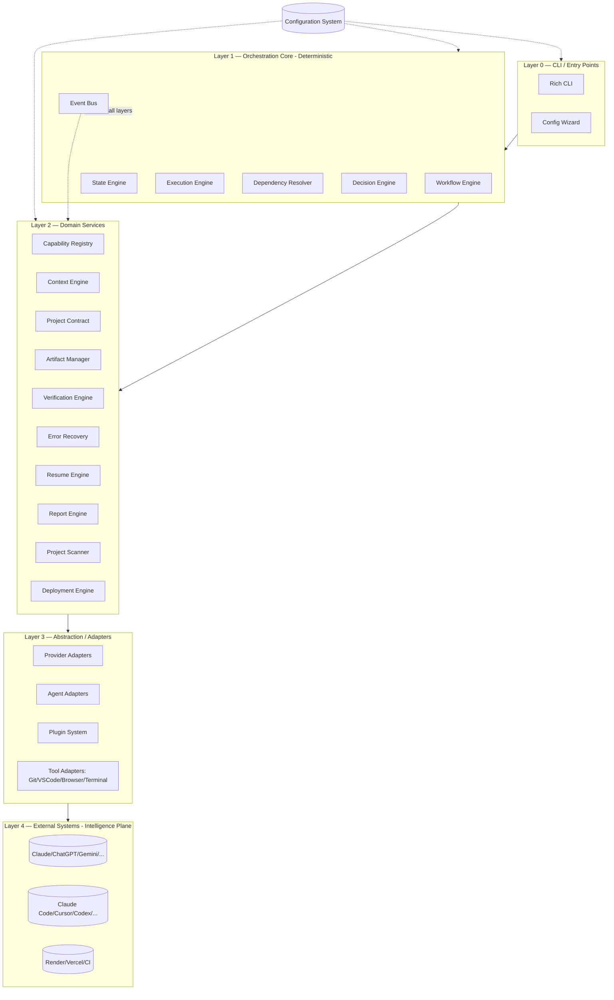

# 02 — Architecture

## Purpose
The single authoritative architecture diagram and layering model for the entire system. Every other document decomposes a piece of this.

## Responsibilities
- Define the layered architecture and the strict dependency direction between layers.
- Define the "no reasoning in core" boundary precisely.
- Define cross-cutting concerns (events, state, config) and where they attach.

## Goals
- Strict separation between **Control Plane** (deterministic orchestration) and **Intelligence Plane** (providers/agents, non-deterministic).
- Every module communicates through declared interfaces, never through shared mutable state.
- No circular dependencies between layers.

## Non-Goals
- This document does not specify language/runtime choice, package layout, or build tooling (deliberately implementation-detail-free, per the quality bar).

## Architecture

**Dependency rule**: a layer may depend only on layers at or below it. Layer 4 never calls upward. Layer 1 (deterministic core) never imports anything from Layer 4 directly — only through Layer 3 adapters, and only through interfaces defined in Layer 2/3.

## Interfaces
- `IWorkflowEngine`, `IStateEngine`, `IExecutionEngine`, `IEventBus` (Layer 1)
- `ICapabilityRegistry`, `IContextEngine`, `IVerificationEngine`, `IDeploymentEngine` (Layer 2)
- `IProvider`, `IAgent`, `IPlugin`, `ITool` (Layer 3)

Full definitions live in their respective documents (04–19).

## Data Models
Cross-cutting entities: `Project`, `WorkflowRun`, `Task`, `Event`, `Capability`, `Artifact`. See `25_DATA_MODELS.md`.

## Workflow
See `00_VISION.md` canonical lifecycle diagram; this document defines *which component owns which step*:

| Lifecycle Step | Owning Component |
|---|---|
| Create Project | Project Contract + Project Scanner |
| Plan | Decision Engine + Workflow Engine |
| Create Architecture | Context Engine (prompt) + Provider |
| Generate Prompts | Context Engine |
| Select Providers | Capability Registry |
| Select Agents | Capability Registry |
| Collect Outputs | Execution Engine |
| Verify | Verification Engine |
| Debug | Error Recovery + Execution Engine |
| Commit | Tool Adapter (Git) |
| Deploy | Deployment Engine |
| Generate Reports | Report Engine |
| Finish | State Engine |

## Examples
A workflow step of type `agent_task` flows: Workflow Engine reads the step → Execution Engine schedules it → Capability Registry resolves which Agent Adapter satisfies the required capability → Context Engine builds the prompt/context payload → Agent Adapter executes → Artifact Manager stores output → Verification Engine checks it → Event Bus emits `task.completed`.

## Failure Scenarios
- A plugin author's code accidentally calls an external API directly from a "core" module. Architecture review must catch and reject this — it violates the dependency rule and breaks provider independence.
- Circular dependency introduced between Context Engine and Capability Registry (e.g., context generation needing to know provider selection, and provider selection needing context to score fit). Resolved by making capability *scoring* a pure function of declared metadata, not live context.

## Future Expansion
- Layer 1 could be extracted into a standalone "orchestration kernel" library usable outside this CLI (e.g., embedded in CI systems).
- Layer 4 could include human-in-the-loop as a first-class "provider" (a human answering a prompt is just another Provider implementation).

## Trade-offs
- Strict layering adds boilerplate (adapters for everything) but is the primary mechanism that keeps the system extensible and testable in isolation.

## Open Questions
- Should Decision Engine live in Layer 1 (deterministic control) or Layer 2 (domain service)? Placed in Layer 1 here because planning decisions gate workflow control flow, but it must remain free of AI reasoning itself (it decides *among options provided by providers*, it does not generate options).

## References
All documents 03–30 are decompositions of this architecture.

## Supersession Notice
This document has been **superseded by** `docs/ARCHITECTURE_FREEZE.md` (v3.0.0).
While this document remains as a historical reference for the original layering model,
the ARCHITECTURE_FREEZE.md document is now the authoritative architecture specification.
Refer to `docs/ARCHITECTURE_AUDIT.md` for a detailed discrepancy analysis between this
document and the frozen architecture.
