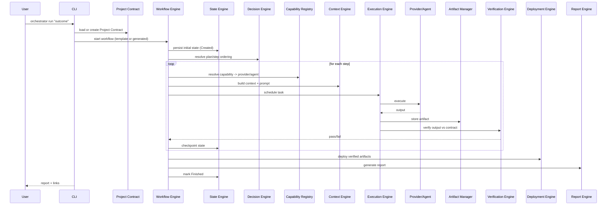

# 03 — System Overview

## Purpose
A practical, end-to-end walkthrough of how a single request flows through every subsystem, for engineers who need the "big picture before the deep dive."

## Responsibilities
- Narrate one full request lifecycle across all major components.
- Serve as the map that points to the detailed document for each stop along the way.

## Goals
- A new contributor can read this single document and understand where their planned change fits.

## Non-Goals
- Not a replacement for the detailed component docs — intentionally shallow.

## Architecture

## Interfaces
See individual component docs. This overview intentionally omits interface signatures.

## Data Models
See `25_DATA_MODELS.md`.

## Workflow
Described fully above; also see `00_VISION.md` for the conceptual lifecycle and `13_WORKFLOW_SPECIFICATION.md` for how a workflow YAML maps onto this sequence.

## Examples
Landing-page example: Project Contract declares a Next.js + Tailwind stack constraint → Decision Engine plans page list → Context Engine generates one prompt per page → Capability Registry picks an agent capable of "nextjs-codegen" → Execution Engine runs each page task (parallel where independent) → Verification Engine runs build + lint + broken-link checks → Deployment Engine ships to Vercel → Report Engine emits a markdown+HTML summary with links and diffs.

## Failure Scenarios
- Any step's failure (agent timeout, verification failure, deployment rejection) triggers Error Recovery (`21_ERROR_RECOVERY.md`) before the workflow continues or halts.
- Process crash mid-run is handled by State Engine checkpoints + Resume Engine (`22_RESUME_ENGINE.md`), not by re-running from scratch.

## Future Expansion
- Parallel multi-project overview (fan-out across repos) — see `29_ROADMAP.md`.

## Trade-offs
N/A — this is a descriptive, not decision-making, document.

## Open Questions
- Should verification failures within a loop auto-retry a bounded number of times before invoking Error Recovery's escalation path, or always escalate immediately? (Current default: bounded auto-retry, see `21_ERROR_RECOVERY.md`.)

## References
`00_VISION.md`, `02_ARCHITECTURE.md`, `13_WORKFLOW_SPECIFICATION.md`, `21_ERROR_RECOVERY.md`, `22_RESUME_ENGINE.md`
`docs/ARCHITECTURE_FREEZE.md` — Frozen architecture v3.0.0
`docs/IMPLEMENTATION_ROADMAP.md` — Phase 1–3 sequence diagram implementation
