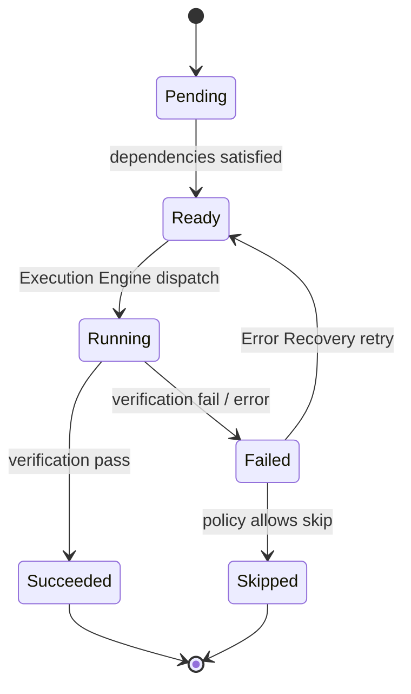
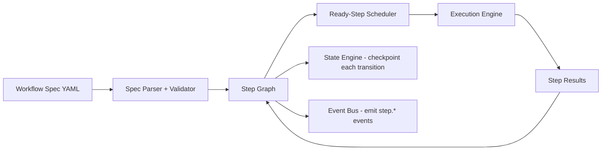

# 04 — Workflow Engine

## Purpose
The Workflow Engine interprets a Workflow Specification (`13_WORKFLOW_SPECIFICATION.md`) — a declarative graph of steps — and drives it to completion by coordinating the Execution Engine, State Engine, Decision Engine, and Event Bus. It is the closest thing the system has to a "conductor," but it contains **zero** reasoning: it only walks a graph and dispatches.

## Responsibilities
- Parse and validate workflow definitions (YAML) against schema.
- Maintain the step graph and its dependency edges.
- Advance workflow state deterministically: `pending → ready → running → {succeeded, failed, skipped}`.
- Delegate all actual work to Execution Engine; delegate all persistence to State Engine; delegate all planning ambiguity to Decision Engine.
- Emit lifecycle events for every transition.

## Goals
- Deterministic step ordering given a fixed graph and fixed step outcomes.
- Support sequential, parallel, conditional, and loop constructs without special-casing them in engine code (all expressed as graph shapes).
- Fully resumable from any checkpoint.

## Non-Goals
- Does not decide *what* a step should do (that's the workflow YAML author's or Decision Engine's job).
- Does not talk to providers/agents directly (delegates to Execution Engine).
- Does not persist state itself (delegates to State Engine).

## Architecture




## Interfaces
```
interface IWorkflowEngine {
  loadSpec(spec: WorkflowSpec): WorkflowGraph
  start(graph: WorkflowGraph, projectContract: ProjectContract): RunHandle
  advance(run: RunHandle): StepBatch          // returns next ready steps
  reportResult(run: RunHandle, step: StepId, result: StepResult): void
  status(run: RunHandle): WorkflowStatus
  cancel(run: RunHandle): void
}

interface WorkflowGraph {
  steps: Map<StepId, StepDefinition>
  edges: Edge[]                                // dependency + conditional edges
}

interface StepDefinition {
  id: StepId
  type: "provider_task" | "agent_task" | "tool_action" | "verification" |
        "deployment" | "decision" | "loop" | "parallel_group" | "manual_gate"
  requires: Capability[]                        // resolved via Capability Registry
  dependsOn: StepId[]
  condition?: Expression                        // deterministic, evaluated against WorkflowRun state
  retryPolicy?: RetryPolicy
  timeout?: Duration
}
```

## Data Models
`WorkflowSpec`, `WorkflowGraph`, `StepDefinition`, `StepResult`, `WorkflowRun` (full schemas in `25_DATA_MODELS.md`).

## Workflow
1. Load and validate spec → build graph (fail fast on cycles unless explicitly a `loop` construct).
2. Compute the initial ready set (steps with no unmet dependencies).
3. Hand ready steps to Execution Engine; block on results.
4. On each result, update graph state, checkpoint via State Engine, emit event.
5. Recompute ready set; repeat until graph fully resolved or a fatal failure halts the run.

## Examples
```yaml
steps:
  - id: plan
    type: decision
  - id: gen_landing_copy
    type: provider_task
    dependsOn: [plan]
    requires: [capability: "copywriting"]
  - id: gen_landing_code
    type: agent_task
    dependsOn: [gen_landing_copy]
    requires: [capability: "nextjs-codegen"]
  - id: verify_build
    type: verification
    dependsOn: [gen_landing_code]
  - id: deploy
    type: deployment
    dependsOn: [verify_build]
    condition: "verify_build.result == 'pass'"
```

## Failure Scenarios
- **Deadlock**: a malformed spec creates a dependency cycle. Parser must detect via topological sort before any execution begins.
- **Partial graph corruption on crash**: mitigated by State Engine checkpointing after every single transition, never batching multiple transitions before persisting.
- **Infinite loop construct**: `loop` steps must declare a max-iteration bound or an explicit exit condition; engine rejects specs without one.

## Future Expansion
- Sub-workflows (a step type that references another workflow spec by ID) for composability.
- Dynamic graph mutation mid-run (e.g., Decision Engine inserting new steps based on verification failure detail) — currently only supported via bounded `loop`/retry constructs, not arbitrary graph edits, to preserve determinism.

## Trade-offs
- Requiring the full graph upfront (vs. dynamically generating steps as you go) sacrifices some flexibility for full resumability and auditability.

## Open Questions
- Should conditional edges support arbitrary boolean expressions over any prior step's output, or only a restricted safe-expression subset (current default: restricted subset, to keep evaluation deterministic and side-effect-free)?

## References
`00_VISION.md`, `13_WORKFLOW_SPECIFICATION.md`, `14_EXECUTION_ENGINE.md`, `09_STATE_ENGINE.md`, `17_EVENT_BUS.md`, `31_DECISION_ENGINE.md`
`docs/ARCHITECTURE_FREEZE.md` — Frozen architecture: Workflow Engine state machine in Layer 1
`docs/IMPLEMENTATION_ROADMAP.md` — Phase 1.3: split engines implementation
