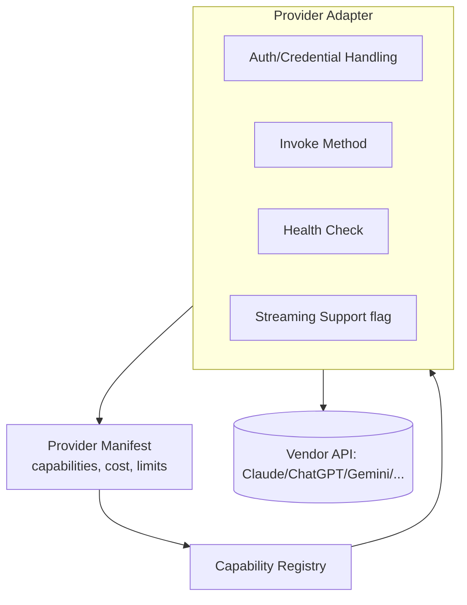
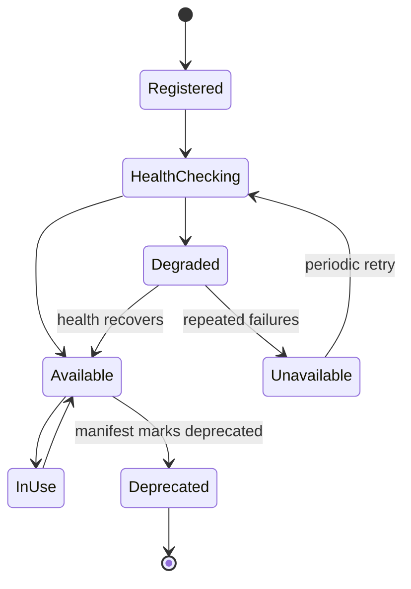

# 05 — Provider System

## Purpose
Defines how AI model providers (Claude, ChatGPT, Gemini, and future providers) plug into the Orchestrator as interchangeable, capability-declaring services — never as special-cased, hard-coded integrations.

## Responsibilities
- Define the `IProvider` interface every provider adapter must implement.
- Define provider lifecycle: registration → health check → capability advertisement → invocation → deprecation.
- Define provider switching/fallback semantics.

## Goals
- Any provider can be added by implementing one interface and a manifest — zero changes to core.
- Provider health and rate-limit state are tracked centrally so the Capability Registry can route around a degraded provider automatically.
- Cost/latency/quality metadata is declared, not inferred, enabling deterministic selection rules.

## Non-Goals
- Does not implement prompt engineering strategy (that's `08_CONTEXT_ENGINE.md`).
- Does not decide *which* provider wins for a task (that's `07_CAPABILITY_REGISTRY.md`); it only exposes what a provider *can* do and *how* to call it.

## Architecture




## Interfaces
```
interface IProvider {
  manifest(): ProviderManifest
  healthCheck(): Promise<HealthStatus>
  invoke(request: ProviderRequest): Promise<ProviderResponse>
  supportsStreaming(): boolean
  estimateCost(request: ProviderRequest): CostEstimate
}

interface ProviderManifest {
  id: string                     // e.g. "anthropic-claude"
  version: string
  capabilities: CapabilityDeclaration[]   // e.g. ["reasoning", "long-context", "vision"]
  costModel: CostModel
  rateLimits: RateLimitPolicy
  contextWindow: number
  deprecated?: boolean
}

interface ProviderRequest {
  prompt: PromptPayload
  context: ContextBundle
  toolUse?: ToolDeclaration[]
  maxTokens: number
}
```

## Data Models
`ProviderManifest`, `ProviderRequest`, `ProviderResponse`, `HealthStatus`, `CostEstimate` — `25_DATA_MODELS.md`.

## Workflow
1. Provider adapter registers manifest at startup (or via Plugin System, `11_PLUGIN_SYSTEM.md`).
2. Capability Registry indexes declared capabilities.
3. On task dispatch, Capability Registry selects a provider by rule; Execution Engine calls `invoke()`.
4. Health checks run on a schedule and after N consecutive failures; state transitions feed back into selection scoring.

## Examples
- Claude adapter manifest declares `["reasoning", "long-context", "code-review", "vision"]`, cost model per input/output token, context window 200K.
- ChatGPT adapter declares `["reasoning", "function-calling", "vision"]`.
- Gemini adapter declares `["reasoning", "long-context", "multimodal-video"]`.
- A future local-model adapter (e.g., an Ollama-backed provider) declares `["reasoning"]` with zero cost and a small context window — automatically eligible for low-stakes steps only, via selection rules in `07_CAPABILITY_REGISTRY.md`.

## Failure Scenarios
- Provider returns malformed/partial output: adapter must normalize into `ProviderResponse` or raise a typed `ProviderError`, never let raw vendor errors leak into the core.
- Provider rate-limited mid-workflow: Execution Engine catches `RateLimitError`, Capability Registry offers a fallback provider satisfying the same capability, or the step retries with backoff per `RetryPolicy`.
- Vendor API breaking change: isolated entirely to that adapter; core is unaffected as long as the adapter still satisfies `IProvider`.

## Future Expansion
- Multi-modal providers (image/video generation) as first-class capability categories.
- Provider cost budgets per Project Contract, enforced by Capability Registry selection rules.
- Human-as-provider adapter (manual gate that satisfies the same interface).

## Trade-offs
- A strict common interface means some provider-specific superpowers (vendor-unique features) require opt-in "extension capabilities" rather than being exposed by default — keeps the core interface stable at the cost of some feature lag.

## Open Questions
- Should cost estimation be mandatory for every provider or optional-with-warning for community-contributed adapters?

## References
`06_AGENT_SYSTEM.md`, `07_CAPABILITY_REGISTRY.md`, `08_CONTEXT_ENGINE.md`, `11_PLUGIN_SYSTEM.md`
`docs/ARCHITECTURE_FREEZE.md` — Frozen architecture: Provider System in Layer 3, provider lifecycle
`docs/IMPLEMENTATION_ROADMAP.md` — Phase 2.1: Provider System implementation

**Implementation Status:** Design only — not yet implemented in code. See `docs/ARCHITECTURE_AUDIT.md` for gap analysis.
