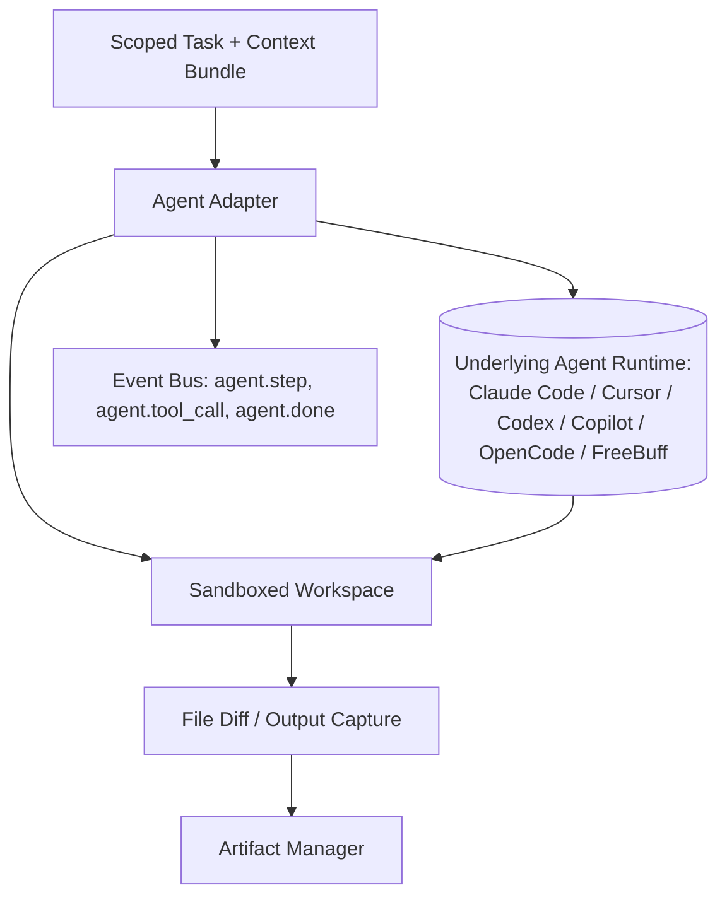

# 06 — Agent System

## Purpose
Defines how autonomous coding agents (Claude Code, Cursor, Codex, GitHub Copilot, OpenCode, FreeBuff, and future agents) are integrated as task executors distinct from raw model Providers — agents typically wrap a provider *plus* tool-use, file-system access, and multi-step autonomy.

## Responsibilities
- Define the `IAgent` interface distinct from `IProvider` (an agent may internally use one or more providers).
- Define how agents receive scoped tasks, workspace access, and constraints.
- Define agent output normalization into Artifacts.

## Goals
- Agents are pluggable and swappable per task, exactly like providers, via capability declarations (e.g., `"nextjs-codegen"`, `"python-refactor"`, `"terminal-execution"`).
- Agents operate inside a sandboxed, scoped Workspace (`32_SUPPORTING_SYSTEMS.md` — Workspace Manager) and never receive broader filesystem/network access than the task requires.
- Agent execution is observable step-by-step via the Event Bus, even though the agent's internal reasoning is opaque.

## Non-Goals
- Does not reimplement any agent's internal reasoning loop — agents are black boxes that receive a task and return artifacts/results.
- Does not grant agents direct access to the Project Contract's authority to *modify* the contract; agents operate *within* it.

## Architecture


## Interfaces
```
interface IAgent {
  manifest(): AgentManifest
  runTask(task: AgentTask, workspace: WorkspaceHandle): Promise<AgentResult>
  cancel(taskId: string): void
  capabilities(): CapabilityDeclaration[]
}

interface AgentManifest {
  id: string                 // e.g. "claude-code", "cursor-cli", "codex"
  capabilities: CapabilityDeclaration[]
  requiresLocalRuntime: boolean
  supportsParallelTasks: boolean
  sandboxRequirements: SandboxSpec
}

interface AgentTask {
  instructions: PromptPayload
  contextBundle: ContextBundle
  workspaceScope: PathScope[]      // explicit allow-list of files/dirs
  toolPermissions: ToolPermission[] // e.g. git-commit: false, network: false
  timeout: Duration
}

interface AgentResult {
  status: "success" | "partial" | "failure"
  fileDiffs: FileDiff[]
  logs: LogEntry[]
  artifacts: ArtifactRef[]
}
```

## Data Models
`AgentManifest`, `AgentTask`, `AgentResult`, `SandboxSpec`, `PathScope` — `25_DATA_MODELS.md`.

## Workflow
1. Execution Engine resolves a step requiring an agent capability via Capability Registry.
2. Workspace Manager provisions a scoped workspace (subset of the project, or an isolated clone/worktree).
3. Context Engine builds the `AgentTask` payload.
4. Agent Adapter runs the underlying agent within the sandbox, streaming events.
5. Output normalized to `AgentResult`; file diffs captured and handed to Artifact Manager; Verification Engine evaluates before merge/commit.

## Examples
- Claude Code adapter: declares `["general-codegen", "refactor", "terminal-execution", "git-aware"]`; runs inside the project's actual worktree with git awareness.
- Cursor adapter: declares `["ide-codegen"]`; may require a running Cursor instance reachable via its automation API.
- Codex adapter: declares `["general-codegen"]`, sandboxed, no local runtime dependency.
- OpenCode/FreeBuff adapters: community-contributed, declare whatever subset of capabilities they actually support — Capability Registry never assumes parity across agents.

## Failure Scenarios
- Agent partially completes a multi-file change then times out: `AgentResult.status = "partial"` with whatever `fileDiffs` exist; Verification Engine and Error Recovery decide whether to retry, roll back, or hand off to a different agent.
- Agent attempts an action outside its granted `workspaceScope` or `toolPermissions`: sandbox must hard-deny, not just warn.
- Two agents assigned to overlapping file scopes in a parallel step: Dependency Resolver (`14_EXECUTION_ENGINE.md`) must prevent this at scheduling time via declared write-scopes.

## Future Expansion
- Agent-to-agent handoff protocol (one agent's partial output becomes another's starting context) as a first-class step type.
- Live agent supervision (pause/inspect/redirect mid-task) via Event Bus + CLI.

## Trade-offs
- Sandboxing every agent invocation adds overhead (workspace provisioning, cleanup) but is required for safety and for reliable parallel execution.

## Open Questions
- Should agents be allowed to request *additional* scope mid-task (an escalation request surfaced to the user), or must scope be fully fixed upfront? Current default: fixed upfront, escalation requires a new task.

## References
`05_PROVIDER_SYSTEM.md`, `07_CAPABILITY_REGISTRY.md`, `14_EXECUTION_ENGINE.md`, `16_ARTIFACT_MANAGER.md`, `32_SUPPORTING_SYSTEMS.md`
`docs/ARCHITECTURE_FREEZE.md` — Frozen architecture: Agent System in Layer 3, workspace sandboxing
`docs/IMPLEMENTATION_ROADMAP.md` — Phase 2.4: Agent System, Phase 4.2: Workspace Manager

**Implementation Status:** Design only — not yet implemented in code. See `docs/ARCHITECTURE_AUDIT.md` for gap analysis.
