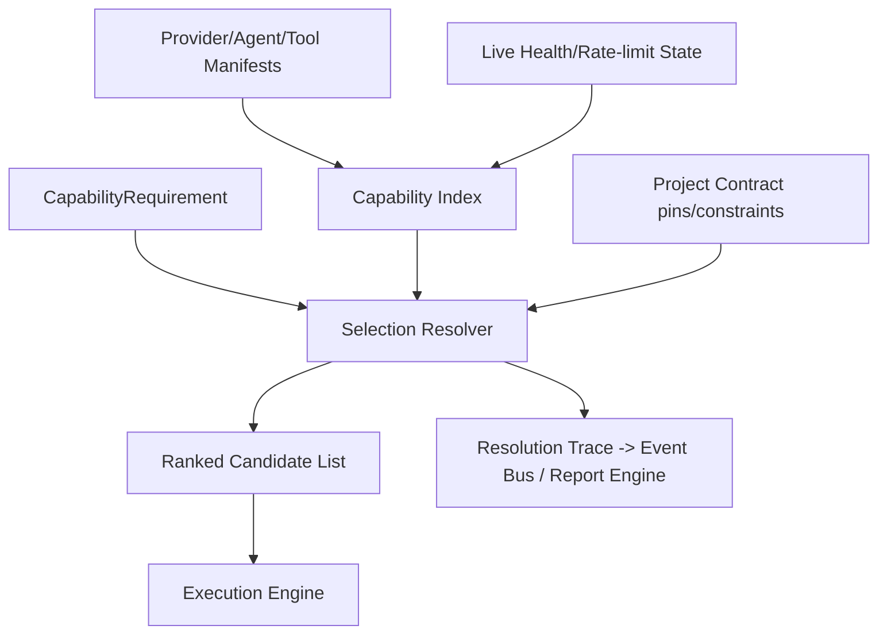

# 07 — Capability Registry (Special Document)

## Purpose
The Capability Registry is the deterministic marketplace-of-one inside the Orchestrator: the component that maps an abstract requirement ("I need nextjs-codegen") to a concrete Provider or Agent, using declared metadata only — never live reasoning.

## Responsibilities
- Maintain the live registry of all registered Providers, Agents, and Tools with their declared capabilities.
- Resolve a `CapabilityRequirement` to a ranked list of candidates.
- Enforce selection rules: priority, fallback chains, versioning, deprecation.
- Track live health/rate-limit state per candidate (fed by Provider/Agent health checks) to influence ranking.

## Goals
- 100% deterministic resolution given the same registry state, requirement, and selection policy.
- Zero hard-coded provider names anywhere in resolution logic.
- Explainable decisions: every resolution produces a trace of *why* a candidate was chosen (for audit/debugging).

## Non-Goals
- Does not itself invoke providers/agents (that's Execution Engine's job after resolution).
- Does not perform any AI-based matching ("smart" selection is a deterministic scoring function over declared metadata, not an LLM call).

### How providers register
A Provider/Agent/Tool adapter registers by submitting a **Capability Manifest** at process start (built-in adapters) or at plugin-load time (`11_PLUGIN_SYSTEM.md`). Registration is validated against a JSON Schema; malformed manifests are rejected with a clear error, never silently dropped.

### How capabilities are declared
Capabilities are declared as a flat list of namespaced strings plus structured metadata:
```
capabilities:
  - id: "codegen.nextjs"
    quality: 0.9          # self-declared or benchmark-derived score, 0-1
    costTier: "medium"
    maxContext: 200000
    latencyClass: "standard"   # "fast" | "standard" | "slow"
  - id: "reasoning.long-context"
    quality: 0.85
```
No capability may be declared without an `id` drawn from the shared **Capability Taxonomy** (a versioned, extensible enum-like registry itself — new capability IDs can be proposed via plugin metadata and are namespaced by author to avoid collisions, e.g. `community.acme.custom-lint`).

### Capability discovery
At startup (and on plugin hot-load), the Registry builds an in-memory index: `capabilityId -> [CandidateRef]`. Discovery is a pure indexing operation; it performs no network calls.

### Selection rules
Resolution for a given `CapabilityRequirement` (which may specify a minimum quality, cost ceiling, or explicit candidate preference from the Project Contract) proceeds as:
1. Filter candidates by capability id match and any hard constraints (cost ceiling, max context, required sandbox support).
2. Exclude candidates currently `Unavailable` (per Provider/Agent health state).
3. Sort remaining candidates by: (a) explicit user/contract pin, if any, (b) declared `quality` descending, (c) `costTier` ascending, (d) `latencyClass` per requirement's urgency flag.
4. Return the ranked list; Execution Engine uses the top candidate, falling back down the list on failure.

### Priority
The Project Contract or Workflow Spec may pin a specific provider/agent for a step (`preferredCandidate: "anthropic-claude"`), which always wins over automatic scoring unless that candidate is `Unavailable`, in which case the next-ranked candidate is used and the substitution is logged as a `capability.fallback` event.

### Fallback
Fallback chains are computed at resolution time, not hard-coded per capability. If the top candidate fails at execution (error, timeout, rate-limit), Execution Engine re-queries the Registry excluding the failed candidate for that task instance only.

### Versioning
Manifests declare `version: semver`. The Registry can hold multiple versions of the same candidate id simultaneously during migrations; resolution defaults to the highest non-deprecated version unless a Workflow Spec pins a version explicitly (useful for reproducibility of a previously-verified workflow).

### Deprecation
A manifest flagged `deprecated: true` is excluded from default resolution but remains resolvable if explicitly pinned (for reproducing historical runs), and the Registry emits a `capability.deprecated_used` warning event when this happens.

### Examples
- Requirement `codegen.nextjs`, no pin → Registry finds Claude Code (quality 0.92) and Cursor (quality 0.85) both declaring it → returns `[claude-code, cursor]`.
- Requirement `reasoning.long-context` with `costCeiling: low` → excludes Claude/ChatGPT premium tiers, resolves to a lower-cost provider or local model if registered.
- Historical run pinned to `codex@1.2.0`, now deprecated in favor of `2.0.0` → resolution honors the pin for that specific replay, emitting a deprecation warning.

## Architecture


## Interfaces
```
interface ICapabilityRegistry {
  register(manifest: CapabilityManifest): void
  deregister(candidateId: string): void
  resolve(req: CapabilityRequirement): RankedCandidates
  updateHealth(candidateId: string, status: HealthStatus): void
  listCapabilities(): CapabilityTaxonomyEntry[]
}
```

## Data Models
`CapabilityManifest`, `CapabilityRequirement`, `RankedCandidates`, `CapabilityTaxonomyEntry` — `25_DATA_MODELS.md`.

## Failure Scenarios
- Two plugins declare the same capability id with incompatible semantics (namespace collision) — mitigated by requiring community capability ids to be author-namespaced.
- All candidates for a required capability are `Unavailable` — resolution returns empty; Workflow Engine surfaces this as a blocking `capability.unresolved` failure, not a silent skip.

## Future Expansion
- A public **Capability Marketplace** (`32_SUPPORTING_SYSTEMS.md`) where community manifests are published, rated, and installed like packages.
- Learned quality scores (opt-in telemetry feeding an aggregate community quality score) — must remain advisory, never override explicit local configuration.

## Trade-offs
- Purely declarative scoring is simpler and auditable but requires manifest authors to be honest/accurate; a bad actor could over-declare quality. Mitigated by optional community rating overlays (future).

## Open Questions
- Should local benchmark runs (the Orchestrator running a small eval suite against a newly registered provider) auto-populate/correct the `quality` score? Proposed for post-v1.

## References
`05_PROVIDER_SYSTEM.md`, `06_AGENT_SYSTEM.md`, `11_PLUGIN_SYSTEM.md`, `14_EXECUTION_ENGINE.md`, `32_SUPPORTING_SYSTEMS.md`
`docs/ARCHITECTURE_FREEZE.md` — Frozen architecture: Capability Registry resolution algorithm
`docs/IMPLEMENTATION_ROADMAP.md` — Phase 1.4: Capability Registry (Minimal) implementation

**Implementation Status:** Design only — not yet implemented in code. See `docs/ARCHITECTURE_AUDIT.md` for gap analysis.
