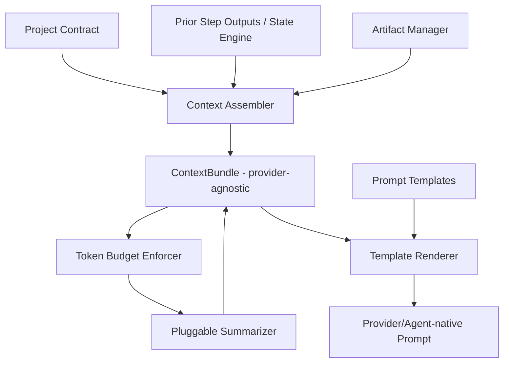

# 08 — Context Engine (Special Document)

## Purpose
The Context Engine is responsible for turning workflow state, project history, and step requirements into the right-sized prompt/context payload for whichever provider or agent is about to be invoked — and for compressing/summarizing accumulated context so it never unboundedly grows.

## Responsibilities
- Assemble `ContextBundle` objects per task: relevant project files, prior step outputs, Project Contract excerpts, conversation history.
- Summarize/compress context when it exceeds a target budget for the destination provider's context window.
- Generate the actual prompt text/structure for a given step type and destination capability.
- Translate context between providers with different context formats (e.g., Claude's document blocks vs. a plain-text agent prompt).

### How context is summarized
Context is layered:
1. **Immutable core** — Project Contract summary (always included, itself kept concise by design, `10_PROJECT_CONTRACT.md`).
2. **Relevant working set** — files/artifacts touched by dependency steps, selected via the Dependency Resolver's step graph (only files a step's dependencies actually produced/touched).
3. **Rolling summary** — prior steps' outputs beyond a recency window are compressed into a structured summary (bullet facts, not prose) rather than dropped, using a deterministic summarization pass (itself a Provider call, but a declared, isolated one — "summarization" is its own capability, auditable and swappable).
4. **Budget enforcement** — Context Engine computes token estimate for the target provider's context window and trims layer 3 first, then non-essential parts of layer 2, before ever touching layer 1.

### Artifacts
Artifacts (file diffs, generated assets, logs) are referenced by pointer (`ArtifactRef`) inside context, not inlined wholesale, unless the step explicitly requires full content (e.g., a code review step needs the full diff). This keeps context bundles composable and avoids redundant duplication across steps.

### Conversation reduction
For multi-turn agent tasks (e.g., an agent iterating with a provider across several tool calls), the Context Engine periodically reduces the transcript: keeping the most recent N turns verbatim and folding older turns into the rolling summary layer above. Reduction is triggered by token budget, not turn count, so it adapts across providers with different window sizes.

### Cross-provider communication
When one step's output (from Provider A) becomes another step's input (for Provider B or an Agent), the Context Engine normalizes the payload into a provider-agnostic `ContextBundle` intermediate representation, then renders it into each destination's native prompt format at invocation time. No component ever passes a Provider-A-specific object directly to Provider B.

### Prompt generation
Prompt generation is template-driven: each step `type` (from `04_WORKFLOW_ENGINE.md`) maps to a Prompt Template that is filled with the `ContextBundle`. Templates are versioned and stored alongside the Project Contract's chosen conventions (tech stack, coding style) so generated prompts are consistent project-to-project without per-step hand-authoring.

## Goals
- Deterministic prompt structure for a given `(step type, context bundle, template version)` triple — the *rendering* is deterministic even though the provider's *response* is not.
- Never silently truncate context in a way that drops the Project Contract or safety/verification constraints.
- Support pluggable summarization strategies (naive truncation, extractive summary, LLM-based abstractive summary) behind one interface.

## Non-Goals
- Does not decide which provider receives the prompt (Capability Registry's job).
- Does not itself verify correctness of a provider's output (Verification Engine's job).

## Architecture


## Interfaces
```
interface IContextEngine {
  buildBundle(step: StepDefinition, run: WorkflowRun): ContextBundle
  enforceBudget(bundle: ContextBundle, window: number): ContextBundle
  render(bundle: ContextBundle, target: ProviderManifest | AgentManifest): PromptPayload
}

interface ContextBundle {
  contractSummary: string
  workingSet: ArtifactRef[]
  rollingSummary: SummaryNote[]
  recentTurns: Turn[]
  metadata: Record<string, unknown>
}
```

## Data Models
`ContextBundle`, `SummaryNote`, `PromptPayload`, `PromptTemplate` — `25_DATA_MODELS.md`.

## Workflow
1. Workflow Engine requests a bundle for the next step.
2. Assembler pulls Project Contract summary, relevant artifacts (via Dependency Resolver's declared inputs), and recent history from State Engine.
3. Budget Enforcer checks against target provider's context window; triggers Summarizer if over budget.
4. Renderer produces the final native payload for the chosen Provider/Agent.

## Examples
- A `verification` step needs only the diff and the contract's acceptance criteria — a narrow bundle.
- A `provider_task` generating architecture docs needs the full contract plus prior planning output — a wide bundle, likely triggering summarization for a smaller-context provider.

## Failure Scenarios
- Summarizer drops a hard constraint (e.g., "must support IE11") because it wasn't tagged as core-contract — mitigated by marking Project Contract fields as non-summarizable by default.
- Two providers interpret the same rendered template differently — mitigated by per-provider template variants and golden-output tests in CI.

## Future Expansion
- Semantic caching of rendered bundles (skip re-summarization if inputs unchanged) — ties into Cache Manager (`32_SUPPORTING_SYSTEMS.md`).
- Retrieval-augmented context from a project Knowledge Base (`32_SUPPORTING_SYSTEMS.md`).

## Trade-offs
- Layered summarization adds complexity versus naive truncation, but is necessary to keep long-running projects usable on smaller-context providers.

## Open Questions
- Should summarization strategy be globally configured or selectable per-step-type?

## References
`05_PROVIDER_SYSTEM.md`, `06_AGENT_SYSTEM.md`, `10_PROJECT_CONTRACT.md`, `16_ARTIFACT_MANAGER.md`, `09_STATE_ENGINE.md`
`docs/ARCHITECTURE_FREEZE.md` — Frozen architecture: Context Engine 4-layer assembly model
`docs/IMPLEMENTATION_ROADMAP.md` — Phase 2.2: Context Engine implementation

**Implementation Status:** Design only — only `prompts.py` template loading exists. See `docs/ARCHITECTURE_AUDIT.md`.
