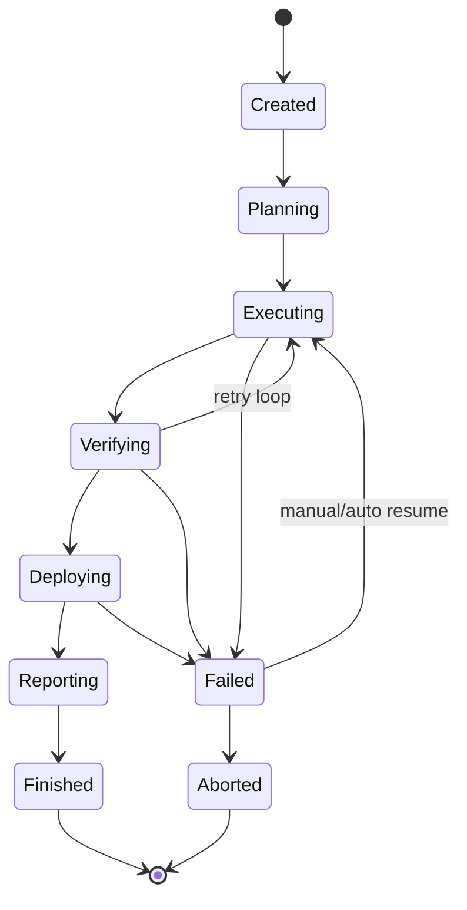
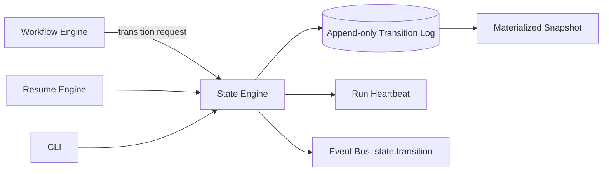

# 09 — State Engine (Special Document)

## Purpose
The State Engine is the single source of truth for "what has happened so far" in a workflow run. It provides the state machine model, durable persistence, crash recovery, and rollback that make the Orchestrator resumable and auditable.

## Responsibilities
- Own the canonical `WorkflowRun` state document and every transition to it.
- Persist state transitions durably and atomically (checkpoint-per-transition, never batched).
- Detect and recover from crashes by reloading the last consistent checkpoint.
- Support rollback to a prior checkpoint (e.g., after a bad deploy).

### State machine
Each `WorkflowRun` is itself a state machine layered above the per-step state machine in `04_WORKFLOW_ENGINE.md`:

Every arrow above corresponds to exactly one atomic, durably-persisted transition record.

### Resume
On `resume(runId)`, the State Engine loads the latest checkpoint, reconstructs in-memory `WorkflowGraph`/`WorkflowRun` objects, and hands control back to the Workflow Engine at the exact step-ready-set that existed at crash time — never replaying already-succeeded steps. See `22_RESUME_ENGINE.md` for the user-facing resume flow; this document defines the underlying persistence guarantee that makes resume possible.

### Persistence
- **Append-only transition log** per run: every transition is written as an immutable, timestamped record before any side-effecting action is taken (write-ahead, not write-after).
- **Materialized current-state snapshot** derived from the log, for fast reads, rebuilt deterministically by replaying the log — never hand-edited independently of the log.
- Storage backend is abstracted behind a `IStateStore` interface (local file-based store by default; pluggable for a future networked backend).

### Crash recovery
On startup, the Orchestrator scans for runs left in a non-terminal state without a recent heartbeat, marks them `Interrupted`, and surfaces them via CLI (`orchestrator resume` or `orchestrator status`) rather than silently resuming automatically — resuming a workflow that touches the filesystem/network should always be an explicit, confirmed action unless the user has configured auto-resume.

### Rollback
Rollback is modeled as a *new* forward transition (`RolledBack(to: checkpointId)`), never as deletion of log history — the transition log is immutable. Rolling back re-applies the Artifact Manager's and Tool Adapters' (e.g., Git) own rollback primitives (e.g., `git revert`, restoring a prior artifact version) as part of executing that transition.

## Goals
- Zero data loss on crash: any transition that was persisted is guaranteed recoverable.
- Full auditability: the entire history of a run can be reconstructed from the log alone.
- No hidden mutable state anywhere else in the system — any component needing to know "where are we" queries the State Engine, it does not keep its own shadow copy.

## Non-Goals
- Does not decide *what* the next step should be (Workflow Engine's job) — only records that a decision/transition happened.
- Does not implement Git-level version control itself (delegates rollback mechanics to Tool Adapters / Artifact Manager).

## Architecture


## Interfaces
```
interface IStateEngine {
  createRun(project: ProjectRef, graph: WorkflowGraph): RunHandle
  transition(run: RunHandle, event: TransitionEvent): RunSnapshot
  currentSnapshot(run: RunHandle): RunSnapshot
  history(run: RunHandle): TransitionRecord[]
  interruptedRuns(): RunHandle[]
  rollback(run: RunHandle, toCheckpoint: CheckpointId): RunSnapshot
}
```

## Data Models
`TransitionRecord`, `RunSnapshot`, `CheckpointId`, `HeartbeatRecord` — `25_DATA_MODELS.md`.

## Workflow
See state diagram above; concretely: every call from Workflow/Execution Engine that changes run status goes through `transition()`, which (a) validates the transition is legal from current state, (b) writes the log record, (c) updates the snapshot, (d) emits an event — in that order, synchronously, before returning control.

## Examples
- Process killed mid-`Executing`: on restart, `interruptedRuns()` surfaces the run; `orchestrator resume <id>` reconstructs from the last `Executing` checkpoint and re-queries Execution Engine for in-flight (not-yet-confirmed) steps rather than assuming they completed.
- Bad deploy detected post-hoc: `orchestrator rollback <id> --to <checkpoint>` triggers `rollback()`, which restores artifacts and re-runs Deployment Engine's rollback primitive.

## Failure Scenarios
- Log write succeeds but snapshot rebuild fails: snapshot must always be rebuildable purely from the log, so this is treated as a snapshot-cache invalidation, not data loss.
- Two processes attempt to transition the same run concurrently: `IStateStore` must provide atomic compare-and-swap semantics per run id to prevent split-brain.

## Future Expansion
- Networked/shared state store for team mode.
- Time-travel debugging UI that replays the transition log step by step.

## Trade-offs
- Write-ahead logging adds I/O overhead per transition versus in-memory-only state, but is the only design that satisfies the zero-data-loss goal.

## Open Questions
- Should heartbeat interval be configurable per workflow (long-running deploys vs. quick code-gen steps)?

## References
`04_WORKFLOW_ENGINE.md`, `14_EXECUTION_ENGINE.md`, `21_ERROR_RECOVERY.md`, `22_RESUME_ENGINE.md`, `16_ARTIFACT_MANAGER.md`
`docs/ARCHITECTURE_FREEZE.md` — Frozen architecture: State Engine with append-only transition log
`docs/IMPLEMENTATION_ROADMAP.md` — Phase 1.2: State Engine implementation (critical path)

**Implementation Status:** Design only — not yet implemented in code. See `docs/ARCHITECTURE_AUDIT.md` for gap analysis.
