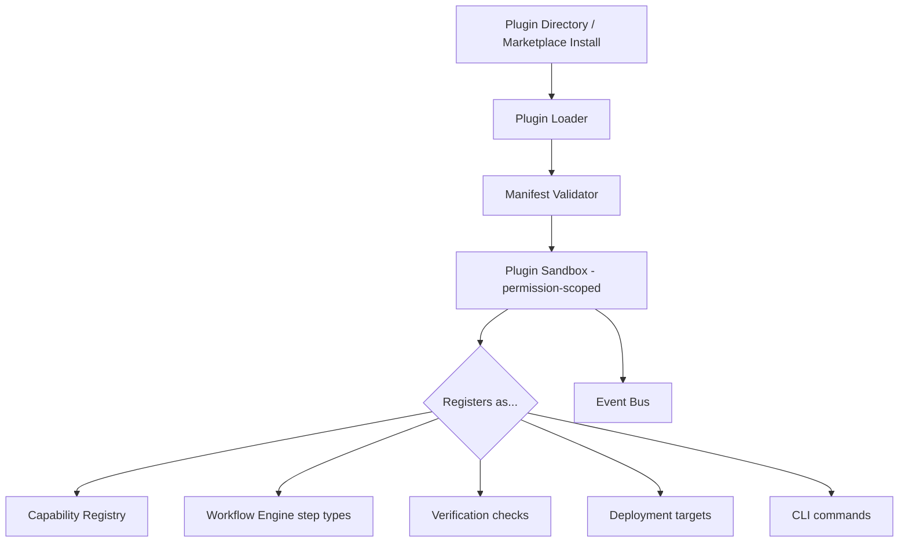

# 11 — Plugin System

## Purpose
Defines how third parties extend the Orchestrator — new providers, agents, tools, workflow step types, verification checks, deployment targets — without modifying core code.

## Responsibilities
- Define the plugin package format, manifest, and lifecycle (discover → validate → load → register → unload).
- Define the sandboxing/permission model for plugin code.
- Provide the single registration path into Capability Registry, Event Bus, and CLI command surface.

## Goals
- A plugin is a self-contained package with a manifest declaring exactly what it extends (`provider`, `agent`, `tool`, `step-type`, `verification-check`, `deployment-target`, `cli-command`).
- Plugins are versioned, and multiple versions can coexist during migration.
- Core never imports a plugin directly — plugins register themselves against core-defined interfaces at load time.

## Non-Goals
- Not a general-purpose scripting/macro system — plugins extend specific, typed extension points only.
- Does not provide plugin-to-plugin direct calling; plugins interact only through core interfaces and the Event Bus.

## Architecture


## Interfaces
```
interface PluginManifest {
  id: string                    // namespaced, e.g. "community.acme.linter"
  version: string
  extends: PluginExtensionPoint[]
  permissions: PluginPermission[]   // e.g. "network", "filesystem:read", "process:spawn"
  entryPoint: string
}

interface IPlugin {
  onLoad(context: PluginContext): void
  onUnload(): void
}

interface PluginContext {
  registerProvider?(provider: IProvider): void
  registerAgent?(agent: IAgent): void
  registerTool?(tool: ITool): void
  registerStepType?(type: string, handler: StepTypeHandler): void
  registerVerificationCheck?(check: IVerificationCheck): void
  registerDeploymentTarget?(target: IDeploymentTarget): void
  registerCliCommand?(command: CliCommandSpec): void
  events: IEventBus
}
```

## Data Models
`PluginManifest`, `PluginPermission`, `PluginExtensionPoint` — `25_DATA_MODELS.md`.

## Workflow
1. Loader scans configured plugin directories (and, in future, an installed-from-marketplace cache).
2. Manifest validated against schema and declared `permissions` cross-checked against local policy (`35` in `32_SUPPORTING_SYSTEMS.md` — Policy Engine).
3. Plugin loaded in a sandbox limited to its declared permissions.
4. `onLoad(context)` called; plugin registers itself against whichever extension points its manifest declares.
5. On shutdown or hot-unload, `onUnload()` called and all registrations for that plugin id are removed.

## Examples
- A community "Codex agent adapter" plugin registers an `IAgent` implementation.
- A "Lighthouse verification" plugin registers an `IVerificationCheck` used by `acceptanceCriteria` with `verificationMethod: "custom-script"`.
- An "internal company deploy" plugin registers a private `IDeploymentTarget` for an internal Kubernetes cluster.

## Failure Scenarios
- Plugin requests permissions beyond what its extension point plausibly needs (e.g., a verification-check plugin requesting `process:spawn` with network) — Policy Engine flags for explicit user approval before load.
- Plugin throws during `onLoad` — Loader isolates the failure, unloads that plugin only, and continues loading others; failure is reported, not fatal to the whole system.
- Two plugins register the same capability id with conflicting behavior — resolved by Capability Registry's namespacing rule (`07_CAPABILITY_REGISTRY.md`), not by the Plugin System itself.

## Future Expansion
- Hot-reload during development (`orchestrator plugin dev` watch mode).
- Signed plugin packages for marketplace trust (`32_SUPPORTING_SYSTEMS.md`).

## Trade-offs
- A typed, extension-point-based plugin API is less flexible than an open scripting hook, but is what makes plugins safely composable and auditable at scale.

## Open Questions
- Should plugins be allowed to declare new Capability Taxonomy entries directly, or must taxonomy changes go through a separate review/PR process even for community plugins?

## References
`05_PROVIDER_SYSTEM.md`, `06_AGENT_SYSTEM.md`, `07_CAPABILITY_REGISTRY.md`, `28_EXTENSION_GUIDE.md`, `32_SUPPORTING_SYSTEMS.md`
`docs/ARCHITECTURE_FREEZE.md` — Frozen architecture: Plugin System in Layer 3, plugin lifecycle, sandboxing
`docs/IMPLEMENTATION_ROADMAP.md` — Phase 4.1: Full plugin lifecycle implementation

**Implementation Status:** Partially implemented (`plugins/base.py`, `plugins/registry.py` exist). Missing: sandboxing, permission model, onLoad/onUnload lifecycle. See `docs/ARCHITECTURE_AUDIT.md`.
