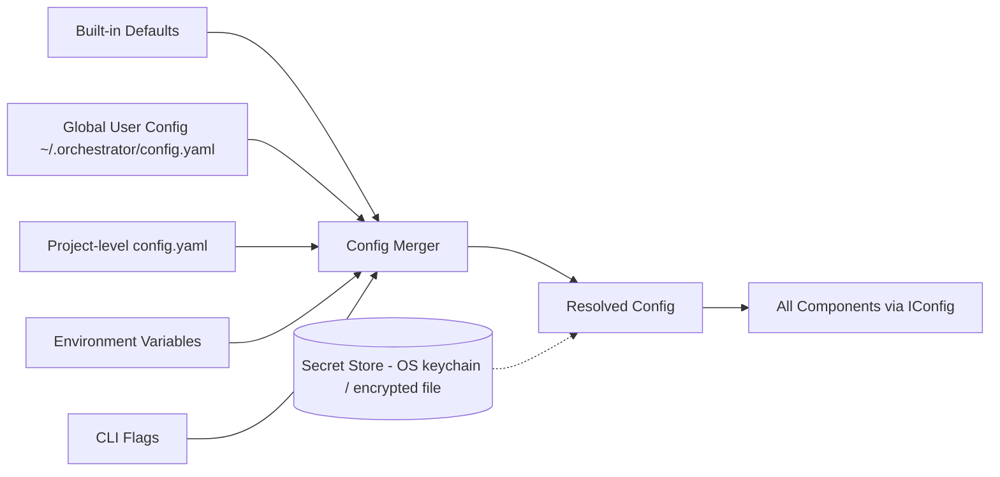

# 12 — Configuration System

## Purpose
Defines how the Orchestrator's own settings (credentials, provider/agent enablement, defaults, policies) are declared, layered, and resolved — separate from the per-project Project Contract.

## Responsibilities
- Define config sources and their precedence.
- Define secret handling (credentials never stored in plain project files).
- Provide a single `IConfig` read surface used by every other component — no component reads environment variables or files directly.

## Goals
- Predictable layering: defaults < global user config < project config < environment overrides < CLI flags.
- Secrets isolated from non-secret config and never written into logs, reports, or state snapshots.
- Config schema is versioned and validated at load time with actionable error messages.

## Non-Goals
- Not a general key-value store for application data (that's Cache/State/Artifact stores).
- Does not manage the Project Contract (a different, project-intent-focused document with its own lifecycle).

## Architecture


## Interfaces
```
interface IConfig {
  get<T>(key: ConfigKey, fallback?: T): T
  getSecret(key: SecretKey): SecretValue   // never logged, never serialized in reports
  layerSources(): ConfigSourceSummary[]     // for debugging precedence
}
```

## Data Models
`ConfigKey`, `ConfigSourceSummary`, `SecretKey` — `25_DATA_MODELS.md`.

## Workflow
1. On startup, Config System loads and merges all layers in precedence order.
2. Secrets are resolved lazily and only handed to the specific Provider/Agent adapter that needs them, scoped to that call.
3. Any component needing config calls `IConfig.get()`; direct env/file access elsewhere is a lint-enforced violation.

## Examples
```yaml
# ~/.orchestrator/config.yaml
providers:
  anthropic-claude:
    enabled: true
  chatgpt:
    enabled: true
defaults:
  maxParallelTasks: 4
  autoResume: false
```
Secrets (`ANTHROPIC_API_KEY`, etc.) resolved via OS keychain by default, environment variable as fallback, never written to `config.yaml`.

## Failure Scenarios
- Missing required secret for an enabled provider: Config System fails fast at wizard/startup with a specific, actionable message, not a deep stack trace mid-workflow.
- Conflicting project vs. global config: project always wins, and `layerSources()` output is available via `orchestrator config debug` to make precedence visible.

## Future Expansion
- Remote/team config sync (shared org defaults) — see `29_ROADMAP.md`.

## Trade-offs
- Layered precedence is more complex to reason about than a single flat file, but is necessary for team/org use without sacrificing per-project overrides.

## Open Questions
- Should secret rotation be handled by the Orchestrator itself, or always delegated to the OS keychain / external secret manager?

## References
`24_CONFIGURATION_WIZARD.md`, `05_PROVIDER_SYSTEM.md`, `35 Policy Engine in 32_SUPPORTING_SYSTEMS.md`
`docs/ARCHITECTURE_FREEZE.md` — Frozen architecture: Configuration System layering, secret handling
`docs/IMPLEMENTATION_ROADMAP.md` — Phase 0: Config merge and cleanup

**Implementation Status:** Partially implemented (`config.py` exists with JSON+YAML profiles). Missing: secret isolation, IConfig interface, schema validation. Two duplicate `config.py` files identified — see `docs/ARCHITECTURE_AUDIT.md`.
