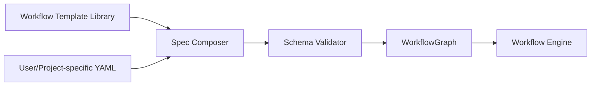

# 13 — Workflow Specification

## Purpose
Defines the declarative YAML format that authors (human or AI-assisted) use to describe a workflow graph, and the schema/versioning rules that keep specs forward-compatible.

## Responsibilities
- Define the full YAML schema for workflow specs.
- Define built-in step type vocabulary (extensible via Plugin System).
- Define spec versioning and validation rules.

## Goals
- Specs are plain, diffable YAML — reviewable in a pull request like any other config.
- Specs are composable (templates + overrides) so common patterns (e.g., "standard Next.js app workflow") are reusable.
- Schema validation happens before any execution begins — no partial runs due to a typo discovered mid-flight.

## Non-Goals
- Not a Turing-complete scripting language — deliberately restricted expression language for conditions (see `04_WORKFLOW_ENGINE.md` open question) to preserve determinism and static analyzability.

## Architecture


## Interfaces
```
schema WorkflowSpec {
  apiVersion: string              // e.g. "orchestrator.dev/v1"
  name: string
  extends?: string                // template reference
  steps: StepDefinition[]         // see 04_WORKFLOW_ENGINE.md
  defaults?: { retryPolicy, timeout }
}
```

## Data Models
`WorkflowSpec`, `StepDefinition`, `RetryPolicy` — `25_DATA_MODELS.md`.

## Workflow
1. Author writes or generates (via Decision Engine-assisted scaffolding) a YAML spec, optionally `extends`-ing a template.
2. Composer merges template + overrides.
3. Validator checks schema, capability references (must exist in Capability Taxonomy), and graph acyclicity.
4. Valid graph handed to Workflow Engine.

## Examples
```yaml
apiVersion: orchestrator.dev/v1
name: "nextjs-feature-add"
extends: "templates/nextjs-standard"
steps:
  - id: scope_check
    type: decision
  - id: implement
    type: agent_task
    dependsOn: [scope_check]
    requires: [capability: "codegen.nextjs"]
  - id: verify
    type: verification
    dependsOn: [implement]
  - id: commit
    type: tool_action
    dependsOn: [verify]
    condition: "verify.result == 'pass'"
```

## Failure Scenarios
- Spec references an undeclared capability id — validator rejects with the exact offending step and a suggestion from the Capability Taxonomy.
- Circular `extends` chain between templates — validator detects and rejects at composition time.

## Future Expansion
- Visual workflow builder that emits this YAML (future GUI, `29_ROADMAP.md`).
- Community Template Registry (`32_SUPPORTING_SYSTEMS.md`).

## Trade-offs
- Restricting the condition/expression language limits some advanced use cases but keeps every spec statically analyzable and safe to run unattended.

## Open Questions
- Should `apiVersion` bumps require an explicit migration tool, or is best-effort backward compatibility sufficient through v1?

## References
`04_WORKFLOW_ENGINE.md`, `10_PROJECT_CONTRACT.md`, `32_SUPPORTING_SYSTEMS.md`
`docs/ARCHITECTURE_FREEZE.md` — Frozen architecture: Workflow Spec schema with apiVersion and extends
`docs/IMPLEMENTATION_ROADMAP.md` — Phase 1.3: Enrich workflow specification

**Implementation Status:** Partially implemented — YAML parser exists but missing `apiVersion`, `extends`, template composition. See `docs/ARCHITECTURE_AUDIT.md`.
