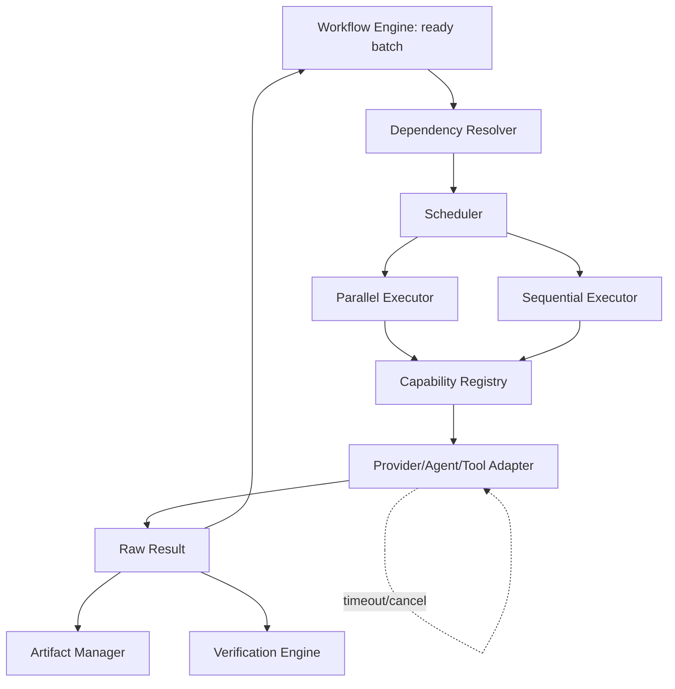

# 14 — Execution Engine (Special Document)

## Purpose
The Execution Engine takes ready steps from the Workflow Engine and actually schedules, dispatches, retries, and bounds them — the layer where "which steps run now, in what order, with what concurrency" is decided.

## Responsibilities
- Task scheduling: turn a batch of ready steps into an ordered/parallel execution plan.
- Execution: invoke the correct adapter (Provider/Agent/Tool) via Capability Registry resolution.
- Retries, timeouts, and parallelism enforcement.
- Dependency-aware conflict prevention (e.g., no two parallel tasks writing the same file scope).

### Task scheduling
Given a ready-step batch from the Workflow Engine, the Scheduler groups steps by whether they are mutually independent (no shared write-scope, no data dependency) and assigns them to either the Parallel Executor or the Sequential Executor accordingly. Grouping is computed by the Dependency Resolver (own responsibility, feeding into this engine) from each step's declared `workspaceScope`/`requires` metadata — never inferred implicitly.

### Execution
For each step, the Engine: resolves capability via Capability Registry → builds context via Context Engine → invokes the adapter → captures raw result → hands to Artifact Manager and Verification Engine → reports result back to Workflow Engine via `reportResult()`.

### Retries
Each step carries a `RetryPolicy` (from spec defaults or step override): `maxAttempts`, `backoff` (`fixed` | `exponential`), and `retryableErrors` (a declared allow-list, e.g. `RateLimitError`, `TransientNetworkError` — never blanket "retry everything," since some failures like `ContractViolationError` should never be blindly retried without Decision Engine involvement).

### Timeouts
Every step has a hard `timeout`. On expiry, the Engine cancels the underlying adapter call (`IAgent.cancel` / provider request abort), marks the step `Failed` with a `TimeoutError`, and hands off to Error Recovery — timeouts never hang the run indefinitely.

### Parallelism
Bounded by a configurable `maxParallelTasks` (Configuration System) and further bounded per-provider by that provider's declared `rateLimits` — the Engine never exceeds a provider's own advertised concurrency ceiling.

### Dependencies
The Dependency Resolver computes the directed acyclic execution order from `StepDefinition.dependsOn` plus inferred write-scope overlaps, exposing a `nextReadyBatch()` used by the Scheduler each cycle.

## Goals
- Maximum safe parallelism without ever violating a declared dependency or write-scope conflict.
- Every execution attempt is individually logged/traceable (which candidate, which attempt number, which duration).
- Cancellation is always possible and always clean (no orphaned processes/workspaces).

## Non-Goals
- Does not decide *whether* a step's output is correct (Verification Engine).
- Does not decide *how* to recover from failure beyond mechanical retry (Error Recovery owns escalation strategy).

## Architecture


## Interfaces
```
interface IExecutionEngine {
  execute(batch: StepBatch): Promise<StepResultBatch>
  cancelStep(stepId: StepId): void
  cancelRun(runId: RunId): void
}

interface RetryPolicy {
  maxAttempts: number
  backoff: "fixed" | "exponential"
  retryableErrors: string[]
}
```

## Data Models
`StepBatch`, `StepResultBatch`, `RetryPolicy`, `ExecutionAttemptRecord` — `25_DATA_MODELS.md`.

## Workflow
See architecture diagram; concretely bounded by: resolve → context → invoke → capture → verify-handoff → report, per step, with retry/timeout wrapping the invoke stage only.

## Examples
- Three independent page-generation steps with disjoint `workspaceScope` run in parallel up to `maxParallelTasks`.
- A `deployment` step always runs sequentially after its dependent `verification` step regardless of global parallelism settings, because it's declared `dependsOn` that step.

## Failure Scenarios
- Provider rate-limit hit mid-parallel-batch: Engine backs off that specific task without blocking sibling parallel tasks.
- Two steps miscomputed as independent due to an under-declared `workspaceScope` (agent wrote outside its declared scope): caught by the sandbox (`06_AGENT_SYSTEM.md`), surfaced as a hard failure, not silently merged.

## Future Expansion
- Speculative execution (start a likely-next step before its formal dependency confirms, roll back if wrong) — deferred, conflicts with strict determinism goals unless carefully scoped.
- Priority queues for interactive/foreground runs vs. background batch runs.

## Trade-offs
- Conservative conflict detection (favoring correctness over max parallelism) trades some throughput for safety — consistent with the determinism-first vision.

## Open Questions
- Should retry backoff be capability-aware (e.g., different default backoff curve for slow long-context providers vs. fast agents)?

## References
`04_WORKFLOW_ENGINE.md`, `07_CAPABILITY_REGISTRY.md`, `20_VERIFICATION_ENGINE.md`, `21_ERROR_RECOVERY.md`
`docs/ARCHITECTURE_FREEZE.md` — Frozen architecture: Execution Engine (separated from Workflow Engine), Dependency Resolver
`docs/IMPLEMENTATION_ROADMAP.md` — Phase 1.3: Split engines implementation

**Implementation Status:** Design only — execution logic is currently merged into `WorkflowEngine.execute()`. See `docs/ARCHITECTURE_AUDIT.md`.
