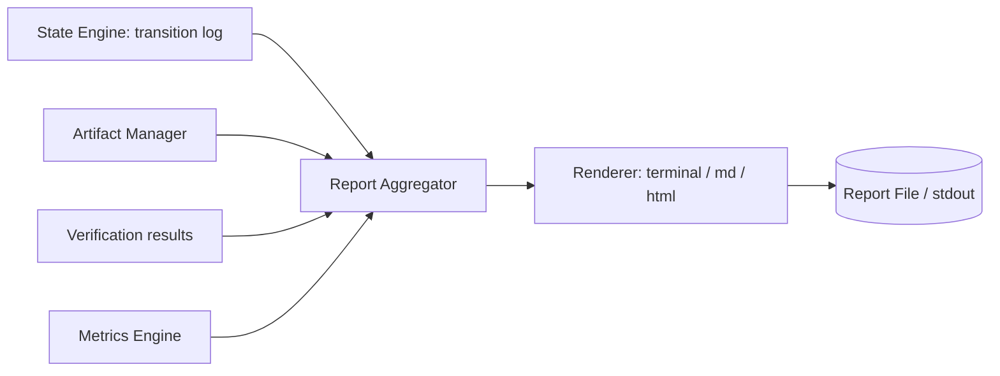

# 15 — Report Engine

## Purpose
Turns a completed (or in-progress) `WorkflowRun`'s transition log, artifacts, and verification results into a human-readable report — the primary way users understand what the Orchestrator actually did.

## Responsibilities
- Render run summaries in multiple formats (terminal, Markdown, HTML).
- Aggregate cost, duration, provider/agent usage, and verification outcomes.
- Link to artifacts, diffs, and deployment URLs.

## Goals
- A report answers, at a glance: what changed, why, who/what made each change, did it pass verification, what did it cost, where is it deployed.
- Reports are generated purely from State Engine + Artifact Manager + Metrics Engine data — never require re-querying providers.

## Non-Goals
- Not a dashboard/analytics product (that's the future hosted offering, `29_ROADMAP.md`) — this is a single-run report generator.

## Architecture


## Interfaces
```
interface IReportEngine {
  generate(runId: RunId, format: "terminal" | "markdown" | "html"): ReportDocument
}
```

## Data Models
`ReportDocument`, `ReportSection` — `25_DATA_MODELS.md`.

## Workflow
1. Aggregator pulls the full transition log and artifact refs for a run.
2. Sections computed: Summary, Timeline, Steps & Outcomes, Cost & Usage, Verification Results, Deployment Links, Errors/Retries.
3. Renderer emits the requested format.

## Examples
A landing-page run report includes: total duration, providers/agents used per step, Lighthouse score from verification, Vercel deploy URL, and a diff summary per generated file.

## Failure Scenarios
- Run interrupted before completion: report generation must still work on partial logs, clearly labeled "Incomplete — run interrupted at step X."

## Future Expansion
- Multi-run comparison reports (regression tracking across runs of the same workflow).

## Trade-offs
- Generating reports purely from persisted data (vs. live re-querying) is slightly less "fresh" for cost estimates but guarantees reports are reproducible and offline-viewable.

## Open Questions
- Should HTML reports be self-contained single files (inlined assets) for easy sharing? Current default: yes.

## References
`09_STATE_ENGINE.md`, `16_ARTIFACT_MANAGER.md`, `20_VERIFICATION_ENGINE.md`, `32_SUPPORTING_SYSTEMS.md`
`docs/ARCHITECTURE_FREEZE.md` — Frozen architecture: Report Engine with terminal/markdown/HTML renderers
`docs/IMPLEMENTATION_ROADMAP.md` — Phase 5.3: Full report engine implementation

**Implementation Status:** Partially implemented — JSON report saving/loading exists. Missing: HTML/markdown renderers, self-contained reports. See `docs/ARCHITECTURE_AUDIT.md`.
