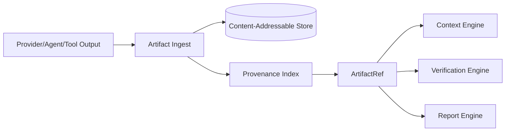

# 16 — Artifact Manager

## Purpose
Owns storage, versioning, and retrieval of every artifact produced during a run: generated files, diffs, logs, screenshots, build outputs.

## Responsibilities
- Content-addressable storage of artifacts with stable `ArtifactRef` pointers.
- Track provenance: which step, which candidate (provider/agent), which run produced each artifact.
- Provide diffing between artifact versions.

## Goals
- Any artifact referenced anywhere in the system (context bundles, reports, verification) resolves through one stable ref format.
- Artifacts are immutable once stored; a "change" always creates a new artifact version with a provenance link to its predecessor.

## Non-Goals
- Not a general object store for arbitrary user files unrelated to a run.
- Does not itself decide what counts as "correct" (Verification Engine).

## Architecture


## Interfaces
```
interface IArtifactManager {
  store(content: Buffer | string, provenance: Provenance): ArtifactRef
  get(ref: ArtifactRef): ArtifactContent
  diff(a: ArtifactRef, b: ArtifactRef): DiffResult
  history(logicalPath: string): ArtifactRef[]
}
```

## Data Models
`ArtifactRef`, `Provenance`, `DiffResult` — `25_DATA_MODELS.md`.

## Workflow
1. Execution Engine hands raw adapter output to Artifact Manager after each step.
2. Manager hashes content, stores under content address, records provenance (step id, candidate id, run id, timestamp).
3. Downstream consumers (Context Engine, Verification Engine, Report Engine) resolve by `ArtifactRef`.

## Examples
- A generated `landing/page.tsx` file from step `gen_landing_code` is stored, diffed against the (empty) prior version, and referenced by the subsequent `verify_build` step.

## Failure Scenarios
- Large binary artifacts (screenshots, build outputs) risk store bloat — mitigated by a configurable retention/GC policy per artifact class.
- Two steps produce artifacts at the same logical path concurrently — Manager stores both as distinct versions; Dependency Resolver's write-scope rules (`14_EXECUTION_ENGINE.md`) should prevent this from being a *silent* conflict.

## Future Expansion
- Pluggable storage backends (local disk default; S3-compatible for team mode).
- Artifact signing for supply-chain provenance.

## Trade-offs
- Immutable content-addressable storage costs more disk space than in-place mutation but is essential for audit, rollback, and diffing guarantees.

## Open Questions
- Default retention window for large binary artifacts?

## References
`09_STATE_ENGINE.md`, `08_CONTEXT_ENGINE.md`, `20_VERIFICATION_ENGINE.md`, `38 Cache Manager in 32_SUPPORTING_SYSTEMS.md`
`docs/ARCHITECTURE_FREEZE.md` — Frozen architecture: Artifact Manager with content-addressed storage
`docs/IMPLEMENTATION_ROADMAP.md` — Phase 3.1: Artifact Manager implementation

**Implementation Status:** Design only — step outputs are stored in an in-memory context dict, not content-addressed. See `docs/ARCHITECTURE_AUDIT.md`.
