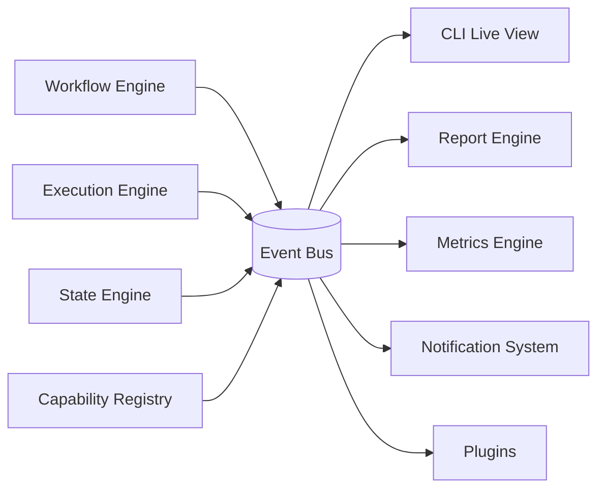

# 17 — Event Bus

## Purpose
Provides the single, typed publish/subscribe backbone that every component uses to observe what's happening elsewhere in the system, without direct coupling.

## Responsibilities
- Define the canonical event taxonomy (`workflow.*`, `step.*`, `state.transition`, `capability.*`, `agent.*`, `provider.*`, `deployment.*`, `plugin.*`).
- Guarantee at-least-once delivery to in-process subscribers within a single run.
- Provide the substrate for CLI live-progress rendering, Report Engine, Metrics Engine, and Notification System.

## Goals
- Every meaningful state change is observable without polling.
- Adding a new subscriber (e.g., a plugin that reacts to `step.failed`) never requires modifying the publisher.

## Non-Goals
- Not a distributed message queue (single-process, in-memory by default) — future networked mode may back it with a real broker, but the interface stays the same.

## Architecture


## Interfaces
```
interface IEventBus {
  publish(event: OrchestratorEvent): void
  subscribe(pattern: string, handler: (e: OrchestratorEvent) => void): Subscription
  unsubscribe(sub: Subscription): void
}

interface OrchestratorEvent {
  type: string           // e.g. "step.failed"
  runId: RunId
  timestamp: string
  payload: Record<string, unknown>
}
```

## Data Models
`OrchestratorEvent`, `Subscription` — `25_DATA_MODELS.md`.

## Workflow
Publishers emit events synchronously with the state change they describe (never "eventually"); subscribers process asynchronously off the hot path so a slow subscriber (e.g., Notification System hitting a webhook) never blocks the Workflow Engine.

## Examples
`step.started`, `step.completed`, `step.failed`, `capability.fallback`, `agent.tool_call`, `deployment.succeeded`, `plugin.loaded`.

## Failure Scenarios
- A subscriber throws: isolated per-subscriber, logged, never propagates back to the publisher or crashes the run.
- Event volume spikes during highly parallel runs: bounded internal queue with backpressure; CLI live-view samples/coalesces high-frequency events for display without dropping them from persisted logs.

## Future Expansion
- Networked event bus (Redis/NATS-backed) for team mode / multi-process daemon architecture.
- External webhook subscriptions managed by Notification System.

## Trade-offs
- In-memory-only bus is simple and fast but means external observability (e.g., a separate monitoring process) requires the future networked mode.

## Open Questions
- Should the event taxonomy be a closed enum or open string namespace (favoring the latter for plugin extensibility, with a documented convention)?

## References
`04_WORKFLOW_ENGINE.md`, `09_STATE_ENGINE.md`, `15_REPORT_ENGINE.md`, `32_SUPPORTING_SYSTEMS.md`
`docs/ARCHITECTURE_FREEZE.md` — Frozen architecture: Event Bus with full event taxonomy
`docs/IMPLEMENTATION_ROADMAP.md` — Phase 1.1: Event Bus (critical path — first Phase 1 dependency)

**Implementation Status:** Design only — no IEventBus exists. Events are logged via stdlib `logging.Logger`. See `docs/ARCHITECTURE_AUDIT.md`.
