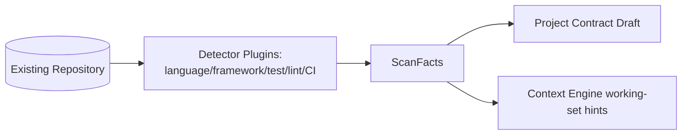

# 18 — Project Scanner

## Purpose
Inspects an existing codebase to infer facts (tech stack, conventions, dependency graph, test setup) that seed a Project Contract when the Orchestrator is pointed at pre-existing code rather than starting from scratch.

## Responsibilities
- Detect language, frameworks, package manager, test framework, lint/format config, CI setup.
- Build a lightweight structural map (directories, entry points, key modules) for the Context Engine's working-set selection.
- Never modify the scanned project; strictly read-only.

## Goals
- Scanning a mid-size repo completes in seconds, not minutes, via targeted heuristics (manifest files, lockfiles, config files) rather than full static analysis by default.
- Output feeds directly and losslessly into `ProjectContract.techStack`/`styleConventions` drafting.

## Non-Goals
- Not a full static analysis / code-intelligence engine (no call-graph analysis, no type inference) — deep analysis is delegated to Agents/Providers when actually needed for a task.

## Architecture


## Interfaces
```
interface IProjectScanner {
  scan(path: string): ScanFacts
}

interface ScanFacts {
  language: string[]
  frameworks: string[]
  packageManager?: string
  testFramework?: string
  lintConfig?: string
  ciProvider?: string
  structuralMap: DirectoryNode[]
}
```

## Data Models
`ScanFacts`, `DirectoryNode` — `25_DATA_MODELS.md`.

## Workflow
1. Orchestrator invoked against an existing path.
2. Scanner runs registered detectors (each a small, fast heuristic; extensible via Plugin System).
3. `ScanFacts` merged into a draft Project Contract for human confirmation (`10_PROJECT_CONTRACT.md`).

## Examples
Detecting `next.config.js` + `package.json` with `next` dependency → `frameworks: ["nextjs"]`; detecting `pytest.ini` → `testFramework: "pytest"`.

## Failure Scenarios
- Monorepo with multiple stacks: Scanner reports per-subdirectory facts rather than forcing a single flat answer; contract drafting surfaces the ambiguity for human resolution.
- Unrecognized/exotic stack: Scanner reports what it can and flags `unknown` fields explicitly rather than guessing silently.

## Future Expansion
- Deep-scan mode (opt-in) using an Agent to produce a richer architectural summary for very large/legacy codebases.

## Trade-offs
- Heuristic-first scanning favors speed and predictability over completeness; acceptable because contract drafting always includes human confirmation.

## Open Questions
- Should Scanner results be cached and incrementally updated on subsequent runs rather than rescanned each time?

## References
`10_PROJECT_CONTRACT.md`, `08_CONTEXT_ENGINE.md`, `11_PLUGIN_SYSTEM.md`
`docs/ARCHITECTURE_FREEZE.md` — Frozen architecture: Project Scanner feeds Contract drafting
`docs/IMPLEMENTATION_ROADMAP.md` — Phase 0/1 — already implemented, minor enrichment only

**Implementation Status:** Mostly implemented. The `ProjectScanner` class is the best doc-code match in the codebase. See `docs/ARCHITECTURE_AUDIT.md`.
