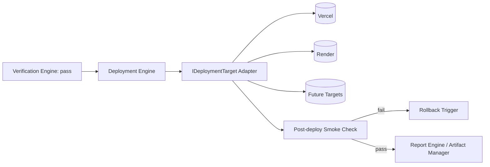

# 19 — Deployment Engine

## Purpose
Abstracts "ship the verified artifact somewhere" across deployment targets (Vercel, Render, future targets like Kubernetes, static hosts, app stores) behind one interface, symmetrical to how the Provider System abstracts AI vendors.

## Responsibilities
- Define `IDeploymentTarget` interface.
- Sequence pre-deploy checks, deploy execution, post-deploy verification (smoke checks), and rollback triggers.
- Record deployment URLs/identifiers as artifacts for the Report Engine.

## Goals
- Adding a new deployment target requires only a new adapter, zero core changes.
- Deployment only ever runs after Verification Engine has passed the relevant acceptance criteria — never bypassable by workflow authors without an explicit, logged override.

## Non-Goals
- Not a general infrastructure-as-code tool; targets wrap their native deploy APIs, they don't reimplement them.

## Architecture


## Interfaces
```
interface IDeploymentTarget {
  manifest(): DeploymentTargetManifest
  deploy(bundle: DeployableBundle): Promise<DeploymentResult>
  rollback(deploymentId: string): Promise<void>
  smokeCheck(deploymentId: string): Promise<HealthStatus>
}
```

## Data Models
`DeploymentTargetManifest`, `DeployableBundle`, `DeploymentResult` — `25_DATA_MODELS.md`.

## Workflow
1. Verification Engine passes the relevant `acceptanceCriteria`.
2. Deployment Engine resolves target (via Capability Registry, capability id namespace `deploy.*`) and builds the `DeployableBundle` from Artifact Manager contents.
3. Adapter deploys; Engine runs `smokeCheck`; on failure triggers `rollback` and Error Recovery.
4. Result recorded as an artifact and surfaced in the report.

## Examples
`deploy.vercel` capability resolves to the Vercel adapter for a Next.js project per the Project Contract's `techStack.deployment`.

## Failure Scenarios
- Deploy succeeds but smoke check fails (e.g., 500 on health endpoint): automatic rollback triggered, Error Recovery escalation logged.
- Target API outage: treated like a Provider outage — Capability Registry fallback logic applies if an equivalent target is configured, otherwise the step fails cleanly with a clear error.

## Future Expansion
- Blue/green and canary deployment strategies as declarable `DeployableBundle` options.
- Multi-target simultaneous deploys (staging + production) as a `parallel_group` of deployment steps.

## Trade-offs
- Mandating verification-before-deploy by default removes a "fast and loose" shortcut some users may want; available only via an explicit, audited override flag.

## Open Questions
- Should rollback be fully automatic on smoke-check failure, or require confirmation for production targets specifically?

## References
`20_VERIFICATION_ENGINE.md`, `07_CAPABILITY_REGISTRY.md`, `16_ARTIFACT_MANAGER.md`, `21_ERROR_RECOVERY.md`
`docs/ARCHITECTURE_FREEZE.md` — Frozen architecture: Deployment Engine with IDeploymentTarget interface
`docs/IMPLEMENTATION_ROADMAP.md` — Phase 3.4: Deployment Engine (Vercel adapter)

**Implementation Status:** Design only — `modules/vercel.py` and `modules/render.py` are URL openers, not deployment engines. See `docs/ARCHITECTURE_AUDIT.md`.
