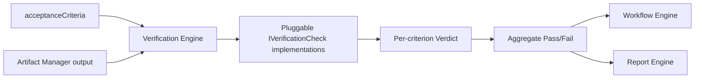

# 20 — Verification Engine

## Purpose
The deterministic gatekeeper: checks every step's output against the Project Contract's `acceptanceCriteria` before the workflow is allowed to proceed to commit/deploy.

## Responsibilities
- Run the declared verification method for each acceptance criterion (`build`, `test`, `lint`, `visual-diff`, `manual-gate`, `custom-script`).
- Aggregate pass/fail into a single verdict per step and per run.
- Never itself decide "close enough" — verification is binary per criterion; only Decision Engine/Error Recovery decide what to do about a failure.

## Goals
- Verification methods are pluggable (`IVerificationCheck`) so new check types (accessibility, security scan, performance budget) can be added without core changes.
- Verification runs in the same sandboxed workspace context as the step it checks, guaranteeing it's checking the actual produced artifact, not a stale copy.

## Non-Goals
- Not a general test-writing tool — it *runs* declared checks, it doesn't author new tests (that's a normal `agent_task` step, whose output can itself become a new acceptance criterion).

## Architecture


## Interfaces
```
interface IVerificationCheck {
  method: string                  // matches AcceptanceCriterion.verificationMethod
  run(criterion: AcceptanceCriterion, artifact: ArtifactRef, workspace: WorkspaceHandle): Promise<Verdict>
}

interface Verdict {
  criterionId: string
  passed: boolean
  details: string
  evidence?: ArtifactRef          // e.g. test output log, screenshot diff
}
```

## Data Models
`Verdict`, `AcceptanceCriterion` (see `10_PROJECT_CONTRACT.md`) — `25_DATA_MODELS.md`.

## Workflow
1. After a step produces an artifact, Workflow Engine invokes Verification for that step's mapped criteria.
2. Each criterion's declared check runs in-workspace; evidence stored via Artifact Manager.
3. Aggregate verdict returned; failing verdicts route to Error Recovery; passing verdicts allow graph advancement.

## Examples
`builds-clean` criterion → `BuildCheck` runs `next build`, captures exit code + log as evidence. `lighthouse-perf` criterion → custom-script check runs Lighthouse CLI against a locally-served build, parses score.

## Failure Scenarios
- Flaky check (e.g., a visual-diff false-positive from font rendering variance): mitigated by configurable tolerance thresholds per check, not by silently marking it "pass anyway."
- Check itself errors (tool crash) vs. genuinely fails the criterion: Engine distinguishes `CheckError` (infrastructure problem, retryable) from `Verdict.passed = false` (genuine failure, routes to Error Recovery/Decision Engine) — these must never be conflated.

## Future Expansion
- Confidence-scored/manual-gate hybrid criteria (auto-check plus optional human sign-off for high-risk changes).
- Security/dependency-vulnerability scan as a built-in check type.

## Trade-offs
- Strict binary verdicts (vs. fuzzy "AI judges if it's good enough") is slower to author checks for but is what makes the entire pipeline trustworthy and deterministic.

## Open Questions
- Should verification evidence always be retained, or garbage-collected after N days for passing runs to save storage?

## References
`10_PROJECT_CONTRACT.md`, `14_EXECUTION_ENGINE.md`, `19_DEPLOYMENT_ENGINE.md`, `21_ERROR_RECOVERY.md`
`docs/ARCHITECTURE_FREEZE.md` — Frozen architecture: Verification Engine with IVerificationCheck interface
`docs/IMPLEMENTATION_ROADMAP.md` — Phase 3.2: Verification Engine implementation

**Implementation Status:** Design only — no IVerificationEngine exists. Step success/failure is determined by plugin exit status only. See `docs/ARCHITECTURE_AUDIT.md`.
