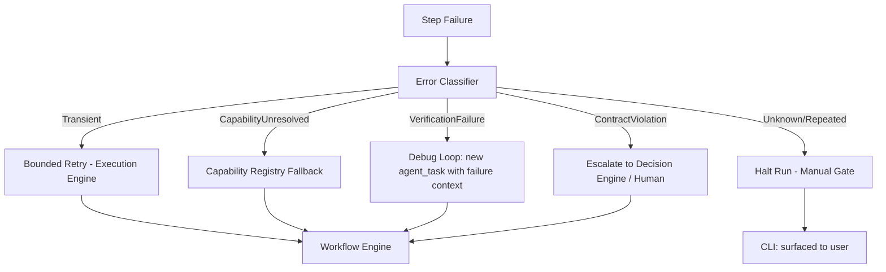

# 21 — Error Recovery

## Purpose
Defines the deterministic policy layer that decides what happens after a step fails: bounded auto-retry, fallback candidate, escalate to Decision Engine, or halt the run for human input.

## Responsibilities
- Classify errors (`TransientError`, `ContractViolationError`, `TimeoutError`, `VerificationFailure`, `CapabilityUnresolved`, `PluginError`).
- Apply the configured recovery strategy per error class.
- Escalate to a human (via CLI prompt or manual gate) when automated recovery is exhausted or inappropriate.

## Goals
- No failure is ever silently swallowed — every failure produces an event and, if unresolved, a clearly surfaced blocking state.
- Recovery strategy is declarative/configurable per error class and per Project Contract risk tolerance, not hard-coded per step type.

## Non-Goals
- Does not itself fix code or reinterpret intent (that's routed back through normal `agent_task`/`provider_task` steps with added context about the failure — reasoning still lives entirely in the Intelligence Plane).

## Architecture


## Interfaces
```
interface IErrorRecovery {
  classify(error: OrchestratorError): ErrorClass
  recover(error: OrchestratorError, step: StepDefinition, run: WorkflowRun): RecoveryAction
}

type RecoveryAction =
  | { kind: "retry" }
  | { kind: "fallback_candidate" }
  | { kind: "debug_loop"; contextAddendum: string }
  | { kind: "escalate" }
  | { kind: "halt"; reason: string }
```

## Data Models
`OrchestratorError`, `ErrorClass`, `RecoveryAction` — `25_DATA_MODELS.md`.

## Workflow
1. Any component raises a typed `OrchestratorError`.
2. Error Recovery classifies and selects a `RecoveryAction` per configured policy (bounded attempt counts prevent infinite debug loops).
3. Action executed; if exhausted (e.g., 3 debug-loop attempts still fail verification), escalates to `halt` and surfaces a manual gate.

## Examples
A `VerificationFailure` on a build step triggers a `debug_loop`: a new `agent_task` step is inserted (bounded, per `04_WORKFLOW_ENGINE.md`'s loop-with-max-iterations rule) with context including the failing build log, re-attempting up to `maxDebugAttempts` before halting.

## Failure Scenarios
- Repeated flapping between retry and failure without progress: Engine tracks attempt history and escalates once a configured attempt ceiling is hit, rather than looping forever.
- Error during error recovery itself (e.g., Decision Engine unavailable): falls back to `halt` as the always-safe terminal action.

## Future Expansion
- Learned recovery policies informed by Metrics Engine history (e.g., "this error class on this provider historically resolves via fallback 90% of the time") — advisory only, never overriding explicit policy.

## Trade-offs
- Bounded, conservative auto-recovery favors predictability over maximum autonomy; users can raise bounds via Project Contract risk tolerance settings if they want more autonomous persistence.

## Open Questions
- Should `ContractViolation` ever be auto-recoverable (e.g., auto-revert the offending change) or always require human escalation? Current default: always escalate.

## References
`04_WORKFLOW_ENGINE.md`, `14_EXECUTION_ENGINE.md`, `20_VERIFICATION_ENGINE.md`, `31_DECISION_ENGINE.md`, `22_RESUME_ENGINE.md`
`docs/ARCHITECTURE_FREEZE.md` — Frozen architecture: Error Recovery error classification and strategies
`docs/IMPLEMENTATION_ROADMAP.md` — Phase 3.3: Formal error recovery implementation

**Implementation Status:** Partially implemented — basic retry config (`RetryConfig`, `OnFailure`) exists. Missing: error classification, debug loop, escalation.
