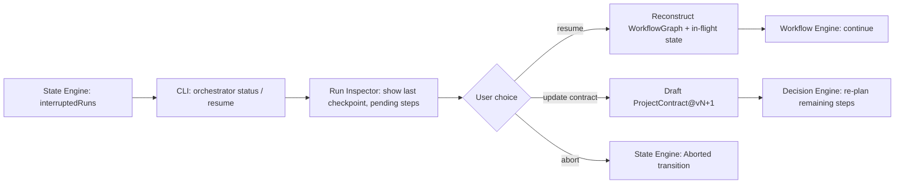

# 22 — Resume Engine

## Purpose
The user-facing layer for detecting, inspecting, and resuming interrupted or halted runs, built on top of the State Engine's durable transition log.

## Responsibilities
- Surface interrupted/halted runs to the user with enough context to decide how to proceed.
- Reconstruct in-memory workflow/execution state from the last durable checkpoint.
- Support "resume as-is," "resume with contract update," and "abort" paths.

## Goals
- Resuming a run never re-executes already-succeeded steps.
- Resume works identically whether the interruption was a process crash, a manual halt (Error Recovery), or a deliberate pause.

## Non-Goals
- Does not itself store state (delegates entirely to State Engine) — purely an orchestration/UX layer over it.

## Architecture


## Interfaces
```
interface IResumeEngine {
  listResumable(): RunSummary[]
  inspect(runId: RunId): ResumeContext
  resume(runId: RunId, options?: ResumeOptions): RunHandle
  abort(runId: RunId): void
}
```

## Data Models
`RunSummary`, `ResumeContext`, `ResumeOptions` — `25_DATA_MODELS.md`.

## Workflow
1. `orchestrator status` lists interrupted/halted runs via State Engine.
2. `orchestrator resume <id>` inspects the last checkpoint, shows pending/in-flight steps, and confirms with the user (unless `autoResume` configured).
3. Workflow Engine resumes from the reconstructed ready-set; in-flight (unconfirmed) steps at crash time are treated as failed-and-retryable, never assumed successful.

## Examples
A `Halt` from Error Recovery due to a `ContractViolation` surfaces with the specific violated constraint; user can either instruct the agent differently (resume with an added context note) or amend the contract (new version) before resuming.

## Failure Scenarios
- Underlying artifacts referenced by the checkpoint were externally deleted: Resume Engine detects missing `ArtifactRef`s and blocks resume with a clear integrity error rather than silently proceeding with holes.

## Future Expansion
- Auto-resume policy with configurable safety bounds (e.g., auto-resume only `TransientError`-halted runs, never `ContractViolation`-halted ones).

## Trade-offs
- Defaulting to confirmed (not automatic) resume is slightly less convenient but consistent with the system's human-in-the-loop safety posture.

## Open Questions
- Should resumed runs get a new run id (linked to the original) or keep the same id? Current default: same id, new transition records appended to the same log for full lineage.

## References
`09_STATE_ENGINE.md`, `21_ERROR_RECOVERY.md`, `10_PROJECT_CONTRACT.md`, `23_CLI_DESIGN.md`
`docs/ARCHITECTURE_FREEZE.md` — Frozen architecture: Resume Engine (built on State Engine checkpoints)
`docs/IMPLEMENTATION_ROADMAP.md` — Phase 4.5: Resume Engine implementation

**Implementation Status:** Design only — requires State Engine (Phase 1) first. See `docs/ARCHITECTURE_AUDIT.md`.
