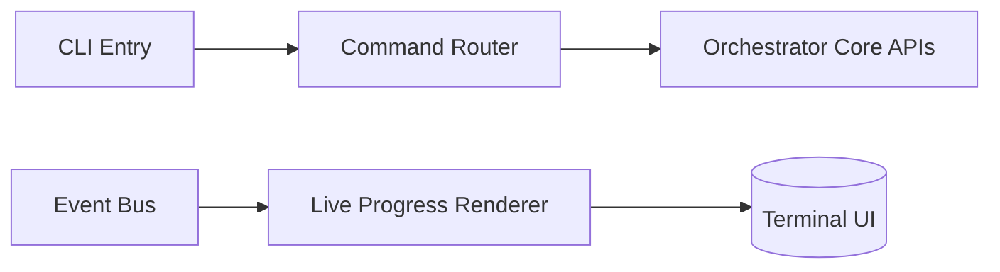

# 23 — CLI Design

## Purpose
Defines the command surface, UX conventions, and live-progress rendering for the Rich CLI — the sole supported interface at v1.

## Responsibilities
- Define command grammar and subcommands.
- Define live progress rendering sourced from the Event Bus.
- Define output conventions (human-readable by default, `--json` for scripting/CI).

## Goals
- Every core lifecycle action has a direct, discoverable command.
- Scriptable: any command supports `--json` output and proper exit codes for CI use.
- Live views never block the underlying run — CLI is a pure observer/controller, consistent with Event Bus non-blocking design.

## Non-Goals
- Not a GUI (future roadmap item, separate document).

## Architecture


## Interfaces (Command Surface)
```
orchestrator init                          # scaffold project + draft contract
orchestrator run "<outcome>"               # create + start a workflow run
orchestrator run --spec <file>             # run from explicit workflow spec
orchestrator status [--all]                # list runs, including interrupted
orchestrator resume <run-id>
orchestrator rollback <run-id> --to <checkpoint>
orchestrator abort <run-id>
orchestrator report <run-id> [--format md|html|json]
orchestrator config [get|set|debug]
orchestrator plugin [install|list|remove]
orchestrator capability list
```

## Data Models
`CliCommandSpec` (extensible by plugins, `11_PLUGIN_SYSTEM.md`).

## Workflow
Command parsed → routed to the relevant core API (Workflow Engine / State Engine / Resume Engine / Report Engine) → live progress subscribes to Event Bus for that run id → terminal renders step tree with status icons, updated in place.

## Examples
```
$ orchestrator run "Add Stripe checkout to /app/billing"
✔ Project contract loaded (v1.2.0)
▶ plan            done
▶ implement       running (agent: claude-code)
  └─ writing app/billing/checkout.tsx
▶ verify          pending
▶ commit          pending
```

## Failure Scenarios
- Terminal doesn't support rich rendering (CI environment): CLI auto-detects and falls back to plain line-based logging.

## Future Expansion
- Interactive TUI dashboard (`ratatui`-style) for multi-run monitoring.

## Trade-offs
- Rich terminal UI adds complexity but is core to the product's "feels like an OS" positioning (`01_PRODUCT.md`).

## Open Questions
- Should `--json` be the default in non-TTY contexts automatically, or always require explicit opt-in?

## References
`17_EVENT_BUS.md`, `22_RESUME_ENGINE.md`, `15_REPORT_ENGINE.md`, `24_CONFIGURATION_WIZARD.md`
`docs/ARCHITECTURE_FREEZE.md` — Frozen architecture: CLI command surface, API proxy pattern
`docs/IMPLEMENTATION_ROADMAP.md` — Phase 0: CLI consolidation, Phase 5.1: Live view

**Implementation Status:** Mostly implemented (Typer CLI in `cli.py`). Two legacy `main.py` files need removal. Missing: `resume`, `rollback`, `abort` commands. See `docs/ARCHITECTURE_AUDIT.md`.
