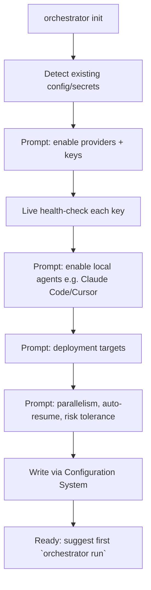

# 24 — Configuration Wizard

## Purpose
The guided first-run experience that gets a new user from "just installed" to "first successful run" in minutes, by walking them through provider/agent registration and sane defaults.

## Responsibilities
- Detect what's already configured (env vars, existing keychain entries) and only ask for what's missing.
- Validate each credential live (a real, cheap health-check call) before accepting it.
- Write results through the Configuration System's proper layering — never bypass it.

## Goals
- Zero-to-first-run in under 5 minutes for a user with at least one provider API key ready.
- Re-runnable idempotently (`orchestrator init --reconfigure`) without duplicating or corrupting existing config.

## Non-Goals
- Not a substitute for `orchestrator config` for power users — wizard is onboarding UX, not the only way to configure.

## Architecture


## Interfaces
```
interface IConfigWizard {
  run(options?: { reconfigure?: boolean }): WizardResult
}
```

## Data Models
`WizardResult`, `WizardStepOutcome` — `25_DATA_MODELS.md`.

## Workflow
See architecture diagram; each step is skippable, and failures (e.g., invalid key) loop back to re-prompt rather than aborting the whole wizard.

## Examples
```
$ orchestrator init
? Enable Anthropic Claude? (Y/n) Y
? ANTHROPIC_API_KEY: ****  ✔ validated
? Enable local agent: Claude Code CLI detected at /usr/local/bin/claude — enable? (Y/n) Y
? Default deployment target: Vercel
✔ Configuration saved to ~/.orchestrator/config.yaml
Run `orchestrator run "<your outcome>"` to get started.
```

## Failure Scenarios
- Invalid/expired key entered: wizard reports the specific validation error (not a generic failure) and re-prompts.
- No providers configured at all: wizard warns clearly that no run can start and offers to exit and configure manually via `orchestrator config`.

## Future Expansion
- Org-wide wizard presets (pre-filled defaults from a shared org config) for enterprise onboarding.

## Trade-offs
- Live validation calls add a small cost/delay during setup but prevent much more confusing failures deep inside a later workflow run.

## Open Questions
- Should the wizard offer to auto-install missing local agent CLIs it detects are absent, or only detect-and-report?

## References
`12_CONFIGURATION_SYSTEM.md`, `05_PROVIDER_SYSTEM.md`, `06_AGENT_SYSTEM.md`, `23_CLI_DESIGN.md`
`docs/ARCHITECTURE_FREEZE.md` — Frozen architecture: Configuration Wizard with live credential validation
`docs/IMPLEMENTATION_ROADMAP.md` — Phase 5.2: Configuration wizard implementation

**Implementation Status:** Design reference — `configure_interactive()` is a seed. Missing: live validation, provider/agent setup flow.
