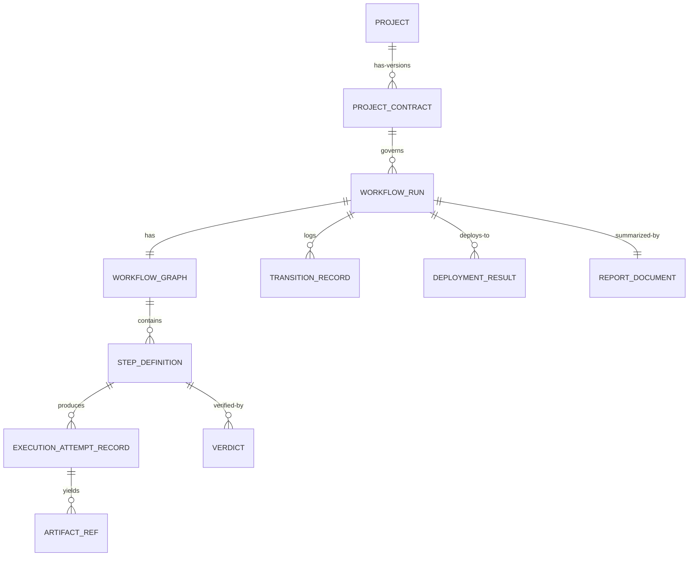

# 25 — Data Models

## Purpose
Central reference for every core data entity referenced across documents 00–24 and 31–33. Individual documents own the *behavior* around these models; this document owns the *shape*.

## Responsibilities
- Provide one canonical schema per entity, avoiding drift between documents.
- Define entity relationships.

## Goals
- Every field referenced elsewhere in the documentation set resolves to a definition here.
- Schemas are storage-agnostic (no assumption of SQL vs. document store).

## Non-Goals
- Not a database migration guide or ORM spec — purely conceptual/logical schema.

## Architecture (Entity Relationships)


## Core Entities

### Project / ProjectContract
```
Project { id, name, rootPath, contracts: ProjectContract[] }
ProjectContract {
  id, projectId, version, status: "draft"|"finalized"|"superseded",
  outcome, techStack, constraints[], styleConventions, acceptanceCriteria[], imports[]
}
```

### WorkflowRun / WorkflowGraph / StepDefinition
```
WorkflowRun { id, projectContractId, specRef, status, startedAt, updatedAt }
WorkflowGraph { runId, steps: Map<StepId, StepDefinition>, edges: Edge[] }
StepDefinition {
  id, type, requires: Capability[], dependsOn: StepId[], condition?,
  retryPolicy?, timeout?, workspaceScope?
}
```

### Execution
```
ExecutionAttemptRecord { stepId, attemptNumber, candidateId, startedAt, endedAt, outcome, error? }
StepResult { stepId, status, artifacts: ArtifactRef[], verdicts: Verdict[] }
```

### State
```
TransitionRecord { runId, fromState, toState, timestamp, cause }
RunSnapshot { runId, currentState, readySteps[], inFlightSteps[], lastCheckpoint }
```

### Capability
```
CapabilityManifest { candidateId, kind: "provider"|"agent"|"tool"|"deployment", capabilities: CapabilityDeclaration[] }
CapabilityDeclaration { id, quality, costTier, maxContext?, latencyClass? }
CapabilityRequirement { capabilityId, costCeiling?, preferredCandidate?, minQuality? }
```

### Artifacts
```
ArtifactRef { hash, logicalPath, producedByStep, candidateId, runId, createdAt }
Provenance { stepId, candidateId, runId, timestamp }
```

### Verification / Deployment
```
Verdict { criterionId, passed, details, evidence? }
DeploymentResult { targetId, deploymentId, url?, status, deployedAt }
```

### Reporting / Events
```
ReportDocument { runId, format, sections: ReportSection[] }
OrchestratorEvent { type, runId, timestamp, payload }
```

## Interfaces
N/A — this document defines data, not behavior.

## Workflow
N/A.

## Examples
See usage examples embedded in each owning document (04, 07–10, 14–20).

## Failure Scenarios
Schema drift between documents is the primary risk this document mitigates — any document introducing a new field must update this file in the same change.

## Future Expansion
Formal JSON Schema / protobuf definitions generated from this conceptual model for the actual implementation phase.

## Trade-offs
Keeping schemas storage-agnostic here trades some precision for durability of the documentation across implementation-technology changes.

## Open Questions
Should this document eventually be auto-generated from source-of-truth schema files once implementation begins, to prevent drift?

## References
All documents.
`docs/ARCHITECTURE_FREEZE.md` — Frozen architecture with entity relationship diagram.
`docs/IMPLEMENTATION_ROADMAP.md` — Phase 1 includes concrete dataclass generation from this schema.
