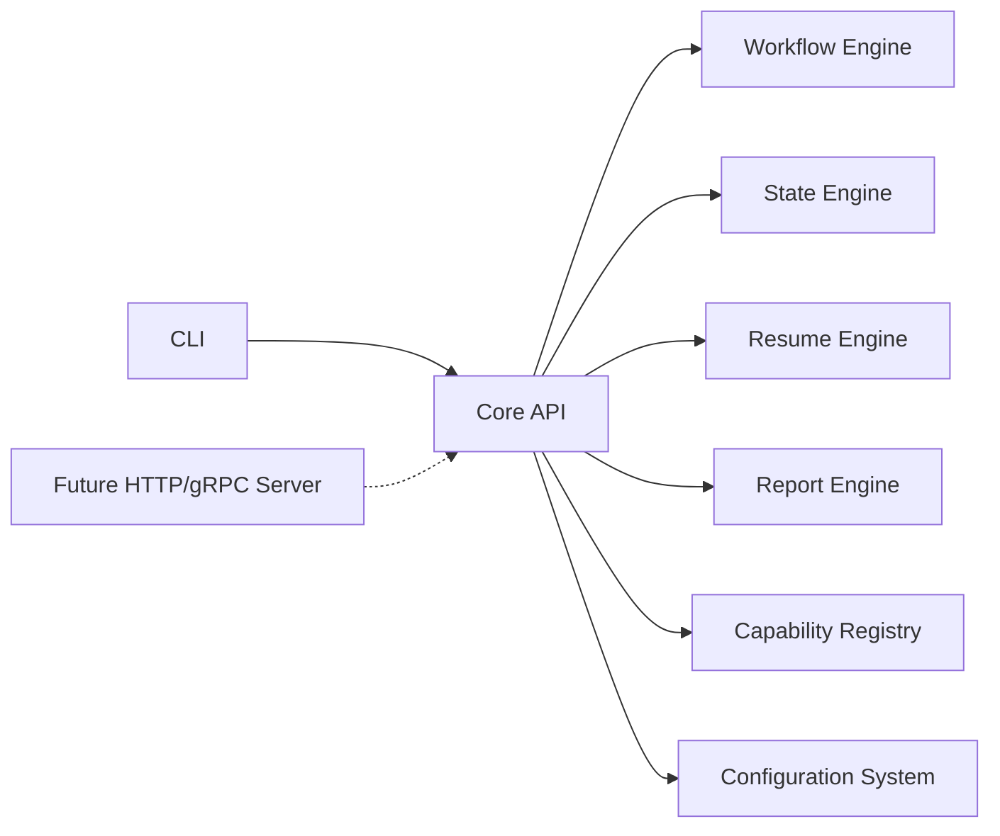

# 27 — API Specification

## Purpose
Defines the programmatic (non-CLI) API surface for embedding or automating the Orchestrator — the interface a future daemon, HTTP API, or CI integration would expose, and that the CLI itself is built on.

## Responsibilities
- Define the core API as the CLI's *only* backend dependency (CLI is a thin client over this API — no logic duplicated).
- Define request/response shapes for the primary operations.
- Define how this maps to a future transport (HTTP/gRPC) without committing to one now.

## Goals
- The exact same API a local CLI process calls in-process today can be exposed over a network transport tomorrow with zero changes to core logic.
- API is capability-complete: nothing the CLI can do is unavailable programmatically.

## Non-Goals
- Does not commit to a specific transport/wire format at v1 (in-process function calls); transport binding is future work (`29_ROADMAP.md`).

## Architecture


## Interfaces
```
interface OrchestratorApi {
  projects: {
    init(spec: ProjectInitSpec): Project
    scan(path: string): ScanFacts
  }
  contracts: {
    draft(project: ProjectRef, outcome: string): ProjectContract
    finalize(contract: ProjectContract): ProjectContract
  }
  runs: {
    start(contract: ProjectContract, specRef?: string): RunHandle
    status(runId: RunId): RunSnapshot
    resume(runId: RunId, options?: ResumeOptions): RunHandle
    abort(runId: RunId): void
    rollback(runId: RunId, toCheckpoint: CheckpointId): RunSnapshot
  }
  reports: {
    generate(runId: RunId, format: ReportFormat): ReportDocument
  }
  capabilities: {
    list(): CapabilityTaxonomyEntry[]
    resolve(req: CapabilityRequirement): RankedCandidates
  }
  config: {
    get<T>(key: ConfigKey): T
    set(key: ConfigKey, value: unknown): void
  }
  events: {
    subscribe(pattern: string, handler: (e: OrchestratorEvent) => void): Subscription
  }
}
```

## Data Models
Reuses all entities from `25_DATA_MODELS.md`.

## Workflow
CLI commands (`23_CLI_DESIGN.md`) are a 1:1 thin wrapper: each CLI subcommand calls exactly one `OrchestratorApi` method and renders its result.

## Examples
`orchestrator run "<outcome>"` internally: `contracts.draft()` → (human confirm) → `contracts.finalize()` → `runs.start()` → subscribe to events for live view → `reports.generate()` on completion.

## Failure Scenarios
API errors are typed `OrchestratorError` subclasses (per `21_ERROR_RECOVERY.md`) so any future transport binding can map them to consistent status codes without inventing new error semantics.

## Future Expansion
- HTTP/gRPC binding for the future daemon/hosted mode.
- SDK packages (Python/JS) generated from this interface for CI/automation use cases.

## Trade-offs
Keeping the API in-process-only at v1 avoids premature transport/security design, at the cost of no remote automation until a future release.

## Open Questions
Should the eventual network transport be gRPC (typed, efficient) or HTTP+JSON (simpler, more universally scriptable)? Leaning HTTP+JSON for v1 of the networked mode, given the CLI/scripting-first audience.

## References
`23_CLI_DESIGN.md`, `04_WORKFLOW_ENGINE.md`, `09_STATE_ENGINE.md`, `29_ROADMAP.md`
`docs/ARCHITECTURE_FREEZE.md` — Frozen architecture: OrchestratorApi design (CLI is thin client)
`docs/IMPLEMENTATION_ROADMAP.md` — Phase 6: API-first architecture

**Implementation Status:** Design only — no `OrchestratorApi` class exists. CLI imports engine directly.
