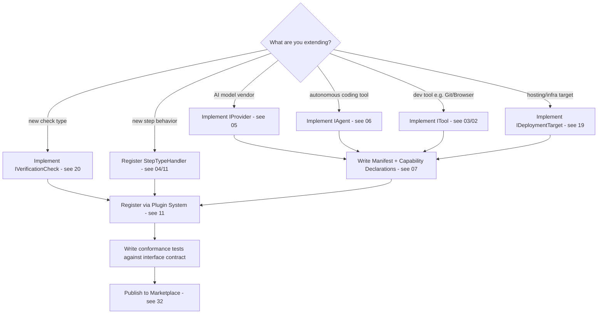

# 28 — Extension Guide

## Purpose
Practical, task-oriented guide for third-party contributors adding a new Provider, Agent, Tool, Deployment Target, Verification Check, or Workflow Step Type.

## Responsibilities
- Give a checklist per extension type.
- Point to the exact interface each extension type must implement.

## Goals
- A competent contributor can ship a working, well-behaved extension without reading the entire architecture set — this document is the fast path, cross-referencing the deep docs only as needed.

## Non-Goals
- Does not replace the authoritative interface definitions in documents 05–20 — this is a guide, not a spec.

## Architecture

## Interfaces
See `05_PROVIDER_SYSTEM.md`, `06_AGENT_SYSTEM.md`, `07_CAPABILITY_REGISTRY.md`, `11_PLUGIN_SYSTEM.md`, `19_DEPLOYMENT_ENGINE.md`, `20_VERIFICATION_ENGINE.md`.

## Data Models
Reuses `PluginManifest`, `CapabilityManifest` from `25_DATA_MODELS.md`.

## Workflow (New Provider Checklist, as representative example)
1. Implement `IProvider` (manifest, healthCheck, invoke, estimateCost).
2. Declare capabilities using existing Capability Taxonomy ids where possible; propose new namespaced ids only if genuinely novel.
3. Write a `PluginManifest` declaring `extends: ["provider"]` and minimal `permissions` (typically just `network`).
4. Write conformance tests: the Plugin System ships a shared conformance test suite every `IProvider` implementation must pass (timeout handling, error typing, streaming flag honesty).
5. Submit to the Capability Marketplace (`32_SUPPORTING_SYSTEMS.md`) for community discovery.

## Examples
Adding a hypothetical "Mistral" provider: implement `IProvider`, declare `["reasoning", "code-review"]`, submit manifest — zero core code changes required.

## Failure Scenarios
Contributor implements only part of `IProvider` (skips `estimateCost`): conformance test suite catches this before merge/publish, not at runtime in a user's workflow.

## Future Expansion
Scaffolding CLI (`orchestrator plugin create <type>`) that generates a starter template per extension type.

## Trade-offs
Requiring conformance tests adds friction for quick community contributions but is essential given how many independent adapters this architecture invites.

## Open Questions
Should conformance test suites be versioned alongside core interface versions, and how strictly should older plugins be required to re-certify against new versions?

## References
`05`–`11`, `19`, `20`, `32_SUPPORTING_SYSTEMS.md`
`docs/ARCHITECTURE_FREEZE.md` — Frozen architecture: All extension interfaces defined
`docs/IMPLEMENTATION_ROADMAP.md` — Phases 2-4: Interfaces implemented progressively

**Implementation Status:** Guide is accurate to design but interfaces don't exist yet.
