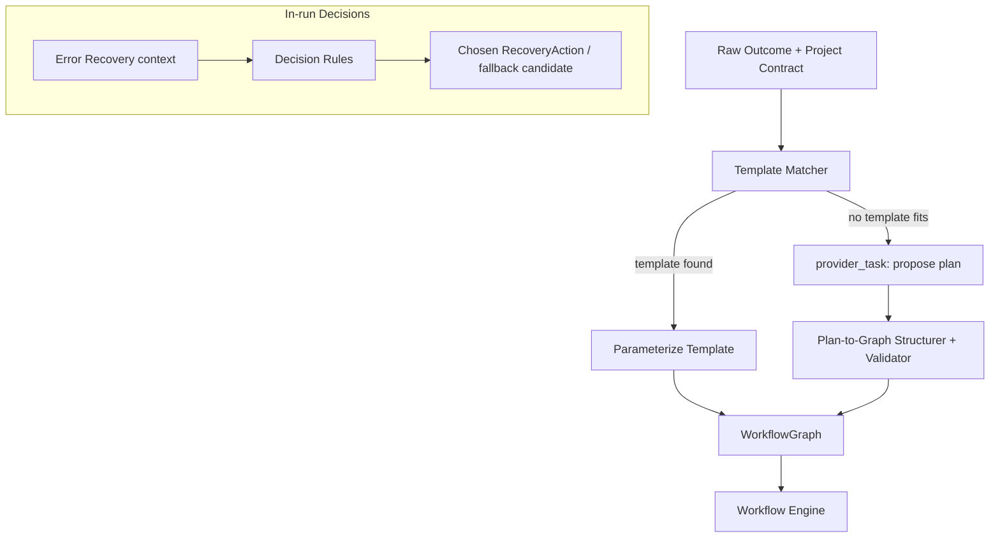

# 31 — Decision Engine (Additional System)

## Why This Was Added
The original spec asked for a workflow engine that walks a pre-built graph, but never defined *who builds the graph* from a raw outcome statement, or *who chooses among multiple valid paths* when the Verification/Error Recovery layer needs a bounded decision (retry vs. fallback vs. escalate is policy, but *which* fallback, *how* to re-scope a debug loop, *how* to decompose "build a landing page" into concrete steps is a planning decision). Without this component, planning logic would have leaked into the Workflow Engine (violating its "walks a graph, doesn't build one" purity) or into the CLI (violating layering). The Decision Engine is added to own this cleanly.

## Purpose
A deterministic **rule-and-policy-based planner and selector** — it decides *among* options (produced by Providers, declared by the Capability Registry, or configured by policy) according to explicit, inspectable rules. It never generates new options itself; option generation is always delegated to a Provider call (a `provider_task` step) or to static configuration.

## Responsibilities
- Translate a raw outcome + Project Contract into an initial Workflow Graph, by selecting from a library of Workflow Templates (`13`, `32`) and parameterizing them — or by delegating to a `provider_task`-generated plan that is then validated and converted into a graph, never trusted verbatim.
- Make bounded in-run decisions: which fallback candidate to try, whether a debug loop should continue or escalate, how to re-scope a step after partial failure.
- Keep every decision traceable to an explicit rule or a specific Provider output it selected from — never an opaque judgment call made "by the Orchestrator itself."

## Goals
- Same inputs (outcome, contract, available templates, capability registry state) → same plan, every time.
- Planning that requires genuine creativity (e.g., "what pages should this SaaS landing page have") is explicitly delegated to a Provider call whose *output* the Decision Engine then structures into graph form — the creativity lives in the Intelligence Plane, the structuring is deterministic.

## Non-Goals
- Does not itself write prompts, generate code, or evaluate content quality — those remain Context Engine / Provider / Verification Engine responsibilities respectively.
- Is not a general rules engine for arbitrary business logic outside the workflow-planning and in-run-decision domain.

## Architecture


## Interfaces
```
interface IDecisionEngine {
  planFromOutcome(outcome: string, contract: ProjectContract): WorkflowGraph
  chooseFallback(req: CapabilityRequirement, excluding: string[]): CandidateRef | null
  decideRecovery(error: OrchestratorError, context: RecoveryContext): RecoveryAction
}
```

## Data Models
`WorkflowTemplate`, `RecoveryContext`, `DecisionTrace` — see `25_DATA_MODELS.md` (extend as implementation proceeds).

## Workflow
1. On `orchestrator run "<outcome>"`, Decision Engine first attempts template matching (fast path, fully deterministic, no Provider call needed for well-known patterns like "landing page," "add feature to existing repo").
2. If no template fits, a bounded `provider_task` is issued asking a Provider to propose a step-by-step plan; the raw proposal is then validated against the Workflow Specification schema (`13`) and rejected/re-prompted if it doesn't structurally validate — the Decision Engine never hands an unvalidated plan to the Workflow Engine.
3. In-run, Error Recovery consults `decideRecovery()` for anything beyond mechanical retry/fallback (those simpler cases are handled directly by `21_ERROR_RECOVERY.md`'s own classifier).

## Examples
"Build a premium SaaS landing page" matches the `landing-page` template, parameterized with page sections inferred from the outcome text via a scoped `provider_task` (page list only, not full plan) merged into the template's fixed step skeleton (design → copy → implement → verify → deploy).

## Failure Scenarios
- Provider-proposed plan references a capability that doesn't exist in the Capability Taxonomy: Structurer rejects and re-prompts with the specific taxonomy, bounded to N attempts before falling back to a generic template or halting for human input.
- Template and outcome are a poor match (template assumes a repo, outcome describes a CLI tool): Template Matcher's scoring must be conservative — prefer falling through to provider-proposed planning over forcing a bad-fit template.

## Future Expansion
- Community-contributed Workflow Templates via Template Registry (`32`).
- Confidence scoring on template matches, surfaced to the user for confirmation when confidence is borderline.

## Trade-offs
- Template-first planning is faster and more predictable than always asking a Provider to plan from scratch, but requires an initial investment in building a good template library, and risks poor fits for novel outcomes if templates are too rigid.

## Open Questions
- Should users be able to inspect and edit the Decision Engine's proposed graph before execution begins by default, or only on request (`--plan-only` flag)? Leaning toward always showing the plan for confirmation, consistent with the Project Contract's human-confirmation gate.

## References
`04_WORKFLOW_ENGINE.md`, `10_PROJECT_CONTRACT.md`, `13_WORKFLOW_SPECIFICATION.md`, `21_ERROR_RECOVERY.md`, `32_SUPPORTING_SYSTEMS.md`
`docs/ARCHITECTURE_FREEZE.md` — Frozen architecture: Decision Engine in Layer 1
`docs/IMPLEMENTATION_ROADMAP.md` — Phase 1.5: Decision Engine (Minimal), Phase 2: Full integration

**Implementation Status:** Design only — no `IDecisionEngine` exists.
