# 32 — Supporting Systems (Additional Systems)

## Why These Were Added
The original spec's "additional features" list (Decision Engine, Capability Marketplace, Template Registry, Plugin Marketplace, Metrics Engine, Knowledge Base, Policy Engine, Audit Engine, Resource Manager, Execution Queue, Dependency Resolver, Cache Manager, Workspace Manager, Notification System, Version Manager) names real gaps. Decision Engine and Dependency Resolver were substantial enough to warrant their own document / inclusion in an existing core document (`31`, `14`). The remainder are grouped here because each is a focused, single-responsibility service consumed by many core components rather than a large architectural pillar of its own — but each is still a first-class, independently implementable and testable system.

## Responsibilities Overview
| System | Owns |
|---|---|
| Metrics Engine | Aggregated numeric telemetry: durations, costs, success rates, retry counts |
| Policy Engine | Declarative rules gating risky actions (plugin permissions, auto-resume, auto-deploy) |
| Audit Engine | Immutable, queryable record of *who/what* took every consequential action |
| Resource Manager | Tracks and enforces budgets: API spend, compute time, concurrent workspace count |
| Cache Manager | Generic memoization layer (context bundles, scan results, verification results for unchanged inputs) |
| Workspace Manager | Provisions/tears down sandboxed filesystem workspaces for Agent tasks |
| Notification System | Delivers run events to external channels (webhook, email, desktop notification) |
| Version Manager | Tracks compatibility between core version, plugin versions, and Project Contract schema versions |
| Template Registry | Stores/serves reusable Workflow Templates (`13`, `31`) |
| Capability Marketplace | Public directory for discovering/installing community Provider/Agent/Tool plugins |
| Knowledge Base | Optional retrieval store of project-specific facts/decisions for Context Engine augmentation |

## Goals
- Each system is independently swappable/disableable without breaking the core lifecycle — these are all *supporting*, not load-bearing for the minimal v1 loop described in `00_VISION.md`.
- Each exposes a narrow interface consumed by name from wherever it's needed (Metrics from Report Engine and Decision Engine; Policy from Plugin System and Error Recovery; etc.) — no system reaches into another's internals.

## Non-Goals
- These are not meant to each become sprawling subsystems; if any grows architecturally significant enough to need its own multi-section document with diagrams, it should graduate out of this shared document.

## Architecture

```mermaid
flowchart TB
    subgraph Supporting[Supporting Systems]
        Metrics[Metrics Engine]
        Policy[Policy Engine]
        Audit[Audit Engine]
        Resource[Resource Manager]
        Cache[Cache Manager]
        Workspace[Workspace Manager]
        Notif[Notification System]
        Version[Version Manager]
        Template[Template Registry]
        Market[Capability Marketplace]
        KB[Knowledge Base]
    end
    EB[Event Bus] --> Metrics
    EB --> Audit
    EB --> Notif
    PluginSys[Plugin System] --> Policy
    ErrorRec[Error Recovery] --> Policy
    ExecEng[Execution Engine] --> Resource
    ExecEng --> Workspace
    ContextEng[Context Engine] --> Cache
    ContextEng --> KB
    ProjScan[Project Scanner] --> Cache
    DecEng[Decision Engine] --> Template
    PluginSys --> Market
    PluginSys --> Version
```


## Interfaces (Representative)
```
interface IMetricsEngine {
  record(metric: MetricSample): void
  query(spec: MetricQuery): MetricSeries
}

interface IPolicyEngine {
  evaluate(action: PolicyCheckableAction): PolicyDecision  // allow | deny | require_confirmation
}

interface IAuditEngine {
  record(entry: AuditEntry): void
  query(filter: AuditFilter): AuditEntry[]   // append-only, tamper-evident (hash-chained)
}

interface IResourceManager {
  reserve(request: ResourceRequest): ResourceGrant | ResourceDenied
  release(grant: ResourceGrant): void
  budgetStatus(scope: BudgetScope): BudgetStatus
}

interface ICacheManager {
  get<T>(key: CacheKey): T | null
  set<T>(key: CacheKey, value: T, ttl?: Duration): void
  invalidate(key: CacheKey): void
}

interface IWorkspaceManager {
  provision(scope: PathScope[]): WorkspaceHandle
  teardown(handle: WorkspaceHandle): void
}

interface INotificationSystem {
  registerChannel(channel: NotificationChannel): void
  notify(event: OrchestratorEvent, channels?: string[]): void
}

interface IVersionManager {
  checkCompatibility(component: VersionedComponent): CompatibilityResult
}

interface ITemplateRegistry {
  list(): WorkflowTemplateSummary[]
  get(id: string): WorkflowTemplate
  publish(template: WorkflowTemplate): void
}

interface ICapabilityMarketplace {
  search(query: string): MarketplaceListing[]
  install(listingId: string): PluginManifest
}

interface IKnowledgeBase {
  query(question: string, scope: ProjectRef): KnowledgeSnippet[]
  ingest(fact: KnowledgeFact): void
}
```

## Data Models
`MetricSample`, `PolicyCheckableAction`, `AuditEntry`, `ResourceRequest`, `CacheKey`, `WorkspaceHandle`, `NotificationChannel`, `WorkflowTemplate`, `MarketplaceListing`, `KnowledgeSnippet` — extend `25_DATA_MODELS.md`.

## Workflow (Representative — Policy Engine gating a risky action)
1. Plugin System is about to load a plugin requesting `filesystem:write` + `network` permissions.
2. Plugin System calls `IPolicyEngine.evaluate()` with the requested action.
3. Policy Engine checks configured rules (from Configuration System) → returns `require_confirmation`.
4. CLI surfaces the confirmation prompt; user approves; Plugin System proceeds; Audit Engine records the approval.

## Examples
- Resource Manager denies starting a 5th parallel agent task when `maxParallelTasks: 4` is configured — Execution Engine queues it instead of failing.
- Cache Manager memoizes Project Scanner results keyed by repo path + last-modified timestamp of manifest files, avoiding redundant rescans on repeated runs.
- Notification System posts a Slack webhook message on `deployment.succeeded` if the user configured that channel.

## Failure Scenarios
- Audit log tampering risk: mitigated by hash-chaining each `AuditEntry` to its predecessor, making silent edits detectable.
- Cache staleness causing a false-pass verification: mitigated by cache keys always including a content hash of relevant inputs, never time-based invalidation alone for correctness-sensitive caches.

## Future Expansion
- Knowledge Base backed by a real vector store for large, long-lived projects.
- Capability Marketplace trust/signing model (`11_PLUGIN_SYSTEM.md` future expansion).

## Trade-offs
- Grouping eleven systems into one document keeps the doc set from exploding to 40+ files, at the cost of less individual depth per system — acceptable since none of these gate the v1 critical path (see `29_ROADMAP.md` Phase 6).

## Open Questions
- Which of these (if any) should be considered part of the v1 minimal core rather than deferred to Phase 6? Current recommendation: Workspace Manager and Cache Manager should move earlier (Phase 4) since Agent parallelism safety genuinely depends on Workspace Manager, not just Dependency Resolver's static analysis.

## References
`11_PLUGIN_SYSTEM.md`, `21_ERROR_RECOVERY.md`, `14_EXECUTION_ENGINE.md`, `08_CONTEXT_ENGINE.md`, `31_DECISION_ENGINE.md`, `29_ROADMAP.md`
`docs/ARCHITECTURE_FREEZE.md` — Frozen architecture: All supporting systems defined as Layer 2 services
`docs/IMPLEMENTATION_ROADMAP.md` — Phase 6: Supporting Systems implementation

**Architecture Audit Note:** This document was flagged for **splitting** — Workspace Manager and Policy Engine are architecturally significant enough to warrant their own documents. See `docs/ARCHITECTURE_AUDIT.md` for rationale.
